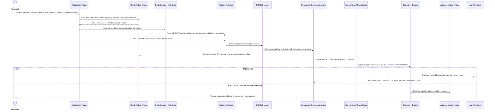
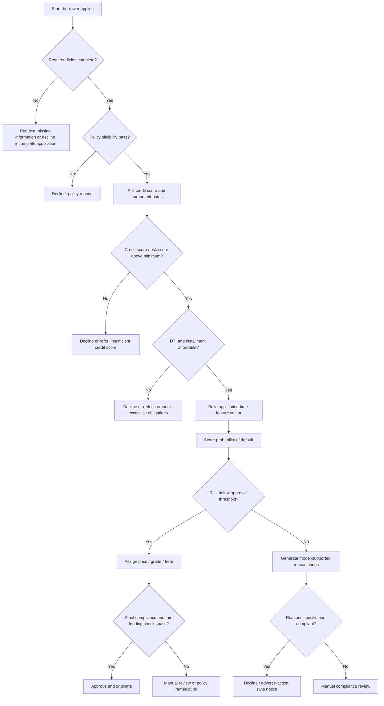

# Consumer Credit Underwriting Workflow

This document maps the LendingClub project fields to a consumer-credit underwriting workflow. The goal is to show where each parameter enters the process, who owns it, and which components should use it.

The workflow is written from the perspective of a **Consumer Credit Underwriter** reviewing an unsecured personal loan application.

## Main Actors And Stakeholders

| Role | Type | What They Care About |
| --- | --- | --- |
| Applicant / Borrower | External actor | Requests credit and provides application information. |
| Consumer Credit Underwriter | Business decision owner | Reviews eligibility, affordability, risk, exceptions, and final approve/decline/refer decision. |
| Credit Policy Manager | Stakeholder | Defines minimum score, DTI, state, amount, term, product, and exception rules. |
| Credit Risk Data Scientist | Model owner | Builds PD/default model, feature pipeline, score thresholds, SHAP explanations, and monitoring. |
| Model Risk Validator | Independent reviewer | Challenges model design, variables, leakage controls, performance, calibration, and monitoring. |
| Fair Lending / Compliance Officer | Compliance stakeholder | Reviews ECOA/Regulation B, proxy-risk variables, adverse-action reasons, and disparate impact. |
| Data Engineer / Analytics Engineer | Data owner | Maintains data ingestion, schema checks, transformations, and lineage. |
| Loan Operations / Servicing | Downstream owner | Handles funded loans, payment events, hardship, recovery, charge-off, and settlement fields. |

## Component View

```mermaid
flowchart LR
    Applicant[Applicant / Borrower]
    Intake[Application Intake]
    Policy[Policy Eligibility Rules]
    Bureau[Credit Bureau / Risk Attributes]
    Afford[Affordability Review]
    Model[PD / Default Risk Model]
    Underwriter[Consumer Credit Underwriter]
    Compliance[Fair Lending and Adverse Action Review]
    Decision[Decision and Pricing]
    Servicing[Post-Origination Servicing]
    Monitoring[Model and Portfolio Monitoring]

    Applicant --> Intake
    Intake --> Policy
    Intake --> Bureau
    Policy --> Afford
    Bureau --> Afford
    Afford --> Model
    Model --> Underwriter
    Policy --> Underwriter
    Underwriter --> Compliance
    Compliance --> Decision
    Decision --> Servicing
    Servicing --> Monitoring
    Model --> Monitoring
```

## End-To-End Underwriting Sequence

## Where Parameters Enter The Workflow

| Process Step | Parameters Added Or Used | LendingClub Columns | Owner | Use In Model? |
| --- | --- | --- | --- | --- |
| Application intake | Requested loan amount | `Amount Requested`, `loan_amnt` | Applicant / Intake | Yes, if available at application. |
| Application intake | Application date or origination month | `Application Date`, `issue_d` | Intake / Data Engineering | Yes for time split and monitoring; usually avoid as a direct risk feature unless justified. |
| Application intake | Loan purpose and title | `purpose`, `title`, `Loan Title`, `desc` | Applicant / Intake | Purpose may be usable. Free text requires privacy, proxy, and PII review. |
| Application intake | Employment length and job title | `emp_length`, `Employment Length`, `emp_title` | Applicant / Intake | Employment length may be usable. Job title is high-cardinality and proxy-risk sensitive. |
| Application intake | Residence geography | `addr_state`, `State`, `zip_code`, `Zip Code` | Applicant / Intake | High fair-lending proxy risk. Use only after compliance review. |
| Application intake | Annual income | `annual_inc`, `annual_inc_joint` | Applicant / Verification | Yes, after validation and missingness review. |
| Application intake | Home ownership | `home_ownership` | Applicant / Intake | Usually usable but should be reviewed for fairness impact. |
| Application intake | Application type | `application_type` | Applicant / Intake | Yes; controls whether joint-applicant fields are structurally available. |
| Credit bureau pull | Credit score range | `fico_range_low`, `fico_range_high`, `Risk_Score` | Bureau / Risk Data | Yes. In rejected data, `Risk_Score` changes meaning over time: FICO before 2013-11-05, Vantage after. |
| Credit bureau pull | Credit history age | `earliest_cr_line`, derived credit-history years | Bureau / Risk Data | Yes, after date parsing. |
| Credit bureau pull | Recent inquiries | `inq_last_6mths`, `inq_fi`, `inq_last_12m` | Bureau / Risk Data | Yes, if application-time available. |
| Credit bureau pull | Delinquencies and derogatories | `delinq_2yrs`, `mths_since_last_delinq`, `mths_since_last_major_derog`, `num_tl_90g_dpd_24m`, `num_accts_ever_120_pd` | Bureau / Risk Data | Yes, if application-time available. |
| Credit bureau pull | Public records and bankruptcies | `pub_rec`, `pub_rec_bankruptcies`, `tax_liens`, `mths_since_last_record` | Bureau / Risk Data | Yes, with compliance and missingness review. |
| Credit bureau pull | Revolving utilization and balances | `revol_bal`, `revol_util`, `total_rev_hi_lim`, `bc_util`, `bc_open_to_buy` | Bureau / Risk Data | Yes, if application-time available. |
| Credit bureau pull | Account depth and activity | `open_acc`, `total_acc`, `acc_open_past_24mths`, `num_sats`, `num_op_rev_tl`, `num_rev_accts` | Bureau / Risk Data | Yes, if application-time available. |
| Affordability review | Debt-to-income ratio | `dti`, `Debt-To-Income Ratio`, `dti_joint` | Intake / Bureau / Policy | Yes. Key affordability variable. |
| Affordability review | Installment burden | `installment`, `term`, derived `term_months` | Pricing / Policy | Use carefully. Term is application-time; installment/rate may be decision/pricing output depending on timing. |
| Policy screen | Lending policy eligibility | `policy_code`, `Policy Code` | Credit Policy | Ambiguous. Treat as policy metadata, not raw borrower risk, until business meaning is confirmed. |
| Pricing and decision | Grade, subgrade, interest rate | `grade`, `sub_grade`, `int_rate` | Pricing / Risk Policy | Do not use for an application-time PD model if they are generated by the lender's decision process. Useful for EDA and benchmarking. |
| Funding | Funded amount | `funded_amnt`, `funded_amnt_inv` | Funding / Platform | Ambiguous. May reflect investor/platform behavior after approval. Review before modeling. |
| Outcome labeling | Repayment result | `loan_status` | Servicing / Data Science | Target label only. Do not use as model input. |
| Servicing after origination | Payment performance | `total_pymnt`, `last_pymnt_d`, `last_pymnt_amnt`, `out_prncp`, `next_pymnt_d` | Servicing | No. Leakage for underwriting model. |
| Servicing after origination | Recoveries and charge-off economics | `recoveries`, `collection_recovery_fee`, `total_rec_late_fee` | Collections / Servicing | No. Leakage for underwriting model. |
| Servicing after origination | Hardship and settlement events | `hardship_*`, `settlement_*`, `debt_settlement_flag` | Servicing / Loss Mitigation | No. Leakage for underwriting model. |
| Post-origination bureau update | Later credit state | `last_credit_pull_d`, `last_fico_range_high`, `last_fico_range_low` | Servicing / Bureau | No. Leakage for underwriting model. |

## Ideal Decision Graph

## Feature Groups For Underwriter Review

| Feature Group | Example Fields | Underwriter Question | Compliance / Model Risk Question |
| --- | --- | --- | --- |
| Capacity | `annual_inc`, `dti`, `installment`, `loan_amnt`, `term` | Can the borrower afford this obligation? | Are calculations consistent and based on application-time data? |
| Credit history | `fico_range_low`, `fico_range_high`, `earliest_cr_line`, `total_acc`, `open_acc` | Does the borrower have enough demonstrated repayment history? | Are score ranges and history measures stable over time? |
| Recent credit stress | `delinq_2yrs`, `inq_last_6mths`, `pub_rec`, `pub_rec_bankruptcies` | Are there recent signs of distress or excessive credit seeking? | Are adverse-action reasons specific and supported? |
| Credit utilization | `revol_util`, `revol_bal`, `bc_util`, `bc_open_to_buy` | Is the borrower overextended on revolving credit? | Are missing values and bureau coverage handled consistently? |
| Stability | `emp_length`, `home_ownership` | Does the borrower show stable employment or residence patterns? | Could the feature act as a protected-class proxy? |
| Geography | `addr_state`, `zip_code`, `State`, `Zip Code` | Are there state/product eligibility constraints? | High proxy-risk; use for eligibility and monitoring before using for risk scoring. |
| Text | `desc`, `title`, `Loan Title`, `emp_title` | Does the borrower provide clarifying context? | High PII/proxy-risk; avoid in baseline model unless specifically reviewed. |
| Lender decision outputs | `grade`, `sub_grade`, `int_rate`, `funded_amnt` | What decision did the historical lender make? | Not raw applicant facts; may leak policy and pricing decisions into the model. |
| Servicing outcomes | `loan_status`, `recoveries`, `last_pymnt_d`, `hardship_*`, `settlement_*` | What happened after origination? | Use for labels and portfolio analysis, not underwriting inputs. |

## RACI Matrix

| Workflow Area | Responsible | Accountable | Consulted | Informed |
| --- | --- | --- | --- | --- |
| Application data collection | Intake / Data Engineer | Product or Operations Lead | Underwriter, Compliance | Risk Modeler |
| Policy rule design | Credit Policy Manager | Head of Credit Risk | Underwriter, Compliance, Legal | Data Scientist |
| Feature selection | Credit Risk Data Scientist | Model Owner | Underwriter, Compliance, Model Validator | Product |
| Leakage review | Data Scientist | Model Owner | Model Validator, Data Engineer | Compliance |
| Fair-lending review | Fair Lending / Compliance Officer | Compliance Lead | Legal, Model Validator, Data Scientist | Underwriter |
| Model training | Data Scientist / ML Engineer | Model Owner | Underwriter, Data Engineer | Compliance |
| Model validation | Model Risk Validator | Model Risk Management | Data Scientist, Underwriter | Compliance, Product |
| Decision threshold setting | Credit Policy Manager | Head of Credit Risk | Data Scientist, Finance, Compliance | Operations |
| Adverse-action reason mapping | Compliance + Credit Policy | Compliance Lead | Underwriter, Data Scientist, Legal | Product |
| Post-origination monitoring | Risk Analytics / Servicing | Head of Credit Risk | Data Engineer, Operations | Compliance |

## Practical Hiring Translation

If the project needs one domain expert to explain the workflow and judge whether the features make business sense, hire a **Consumer Credit Underwriter** or **Credit Policy Manager** from unsecured personal loans, installment lending, fintech lending, or bank consumer lending.

If the project needs one expert to approve model methodology, hire a **Credit Risk Model Validation Manager**.

If the project needs one expert to approve generated denial explanations, hire a **Fair Lending / Adverse Action Compliance Specialist**.

The best real-world review panel is three people:

1. **Consumer Credit Underwriter**: validates process, business meaning, and realistic decision flow.
2. **Credit Risk Data Scientist or Model Validator**: validates model variables, leakage, calibration, and monitoring.
3. **Fair Lending Compliance Officer**: validates proxy risk, reason codes, and adverse-action language.
