<div align="center">

# CreditRisk Interpretation RAG System

### A leakage-aware credit-risk modeling, interpretation, retrieval, and adverse-action-style generation project for LendingClub loan outcomes

*Predict default risk from accepted-loan records, compare model families, calibrate probabilities, explain model behavior with SHAP, retrieve regulatory support, and generate auditable adverse-action-style letters as a research prototype.*

**[Linda Perez Penaranda](https://github.com/lindaperez)<sup>1</sup> · Yashaswi Aryan<sup>1</sup> · [Siddharth Agarwal](https://github.com/ag-siddharth) <sup>1</sup>**

<sup>1</sup> Northeastern University - CS 6140 Machine Learning - Final Project · Summer 2026

Linda Perez Penaranda: collaborator, credit-risk framing, EDA, cleaning, modeling, policy analysis, reproducibility · Yashaswi Aryan: collaborator, model/retrieval workflow and project development · Siddharth Agarwal: collaborator, model/retrieval workflow and project development


[Overview](#overview) · [Demo](#demo) · [Installation](#installation) · [Architecture](#architecture) · [Current Progress](#current-progress) · [Artifacts](#artifact-inventory-by-folder) · [Modeling](#modeling-key-decisions) · [SHAP](#shap-interpretation-results) · [Generation](#letter-generation-results) · [Evaluation](#letter-generation-evaluation) · [Data](#data) · [Reproducibility](#reproducibility) · [Documentation](#documentation) · [References](#references)

</div>

## Overview

CreditRiskRAG is a credit-risk machine learning project using LendingClub accepted-loan data to build a leakage-aware default-risk model, evaluate business operating policies, explain selected model behavior with SHAP, retrieve regulatory evidence, and generate adverse-action-style letters for comparison against a no-RAG baseline.

The current project is strongest as an end-to-end research prototype: EDA, cleaning, preprocessing, model comparison, calibration, operating-policy analysis, SHAP interpretation, regulatory corpus construction, hybrid retrieval, RAG letter generation, no-RAG control generation, and blind LLM-judge evaluation. The generation layer is not positioned as compliance-approved production software; it is an explanation bridge for a final ML project.

## Demo

The letter-generation demo is a static GitHub Pages site:

[Open the GitHub demo](https://lindaperez.github.io/CreditRiskRAG/)

Direct GitHub views:

- [Overview](https://lindaperez.github.io/CreditRiskRAG/rag_letter_demo.html#overview)
- [Letters](https://lindaperez.github.io/CreditRiskRAG/rag_letter_demo.html#letters)
- [Evaluation](https://lindaperez.github.io/CreditRiskRAG/rag_letter_demo.html#evaluation)

GitHub deploy source:

- [Demo HTML](generation/demo/rag_letter_demo.html)
- [GitHub Pages workflow](.github/workflows/deploy-demo-pages.yml)

First-time GitHub setup: in the repository settings, set **Pages -> Source** to **GitHub Actions**. After the workflow runs, the demo is served from the GitHub Pages URL above.

Optional local run from the `CreditRiskRAG/` folder:

```bash
python3 generation/demo/serve_demo.py
```

Then open:

```text
http://127.0.0.1:8000/rag_letter_demo.html
```

The demo does not call Gemini, run retrieval, or require API keys; it renders the completed run from saved artifacts:

| Demo Input | Artifact |
| --- | --- |
| RAG letters | `generation/output/letters.jsonl` |
| No-RAG control letters | `generation/output/letters_norag.jsonl` |
| Blind judge records | `generation/output/judged.jsonl` |
| Aggregate scores | `generation/output/results.json` |

Demo flow:

```text
XGBoost risk score
-> SHAP borrower reasons
-> regulatory retrieval
-> RAG letter generation
-> blind LLM judge scoring
```

Measured demo result: no-RAG overall statutory-accuracy score `0.60`; RAG overall statutory-accuracy score `0.76`.

### Demo Screenshots

| Demo Overview | Evaluation Results |
| --- | --- |
| 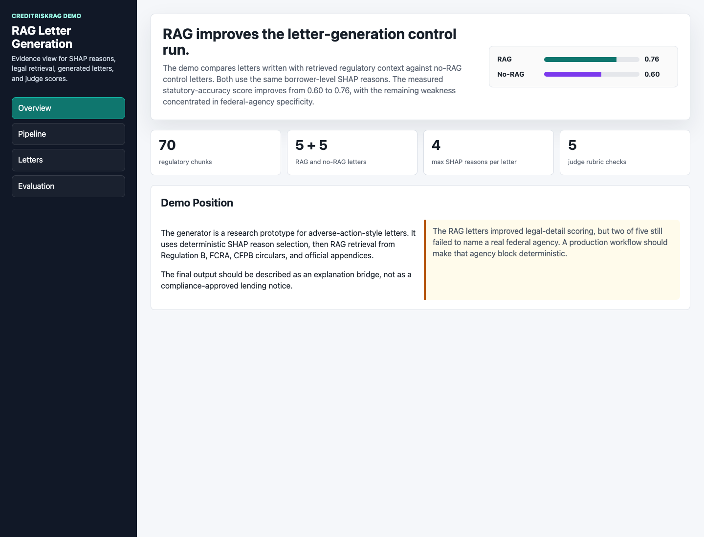<br><br>**What it shows:** The demo's summary view with the RAG vs no-RAG score comparison, corpus size, letter count, SHAP reason cap, and judge rubric count. | 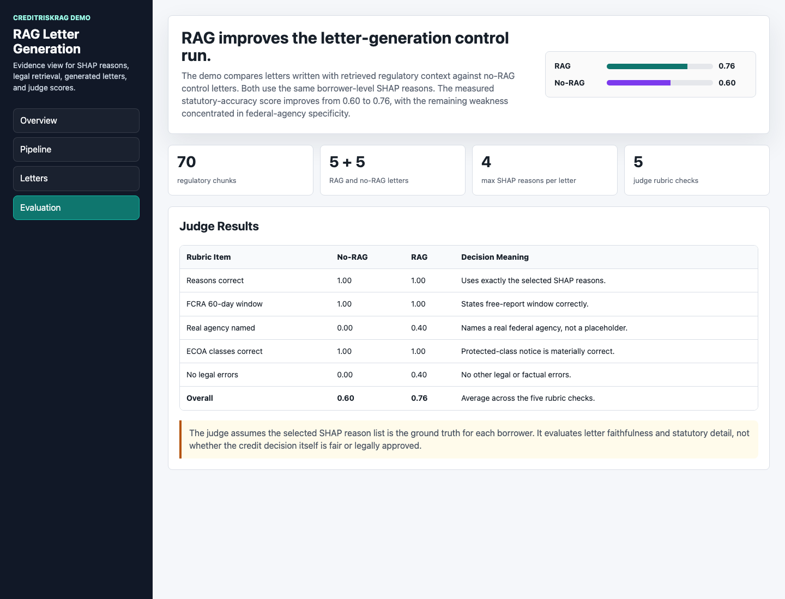<br><br>**What it shows:** The blind judge score table comparing no-RAG and RAG letters across selected reasons, FCRA timing, federal agency naming, ECOA language, and legal-error checks. |
| 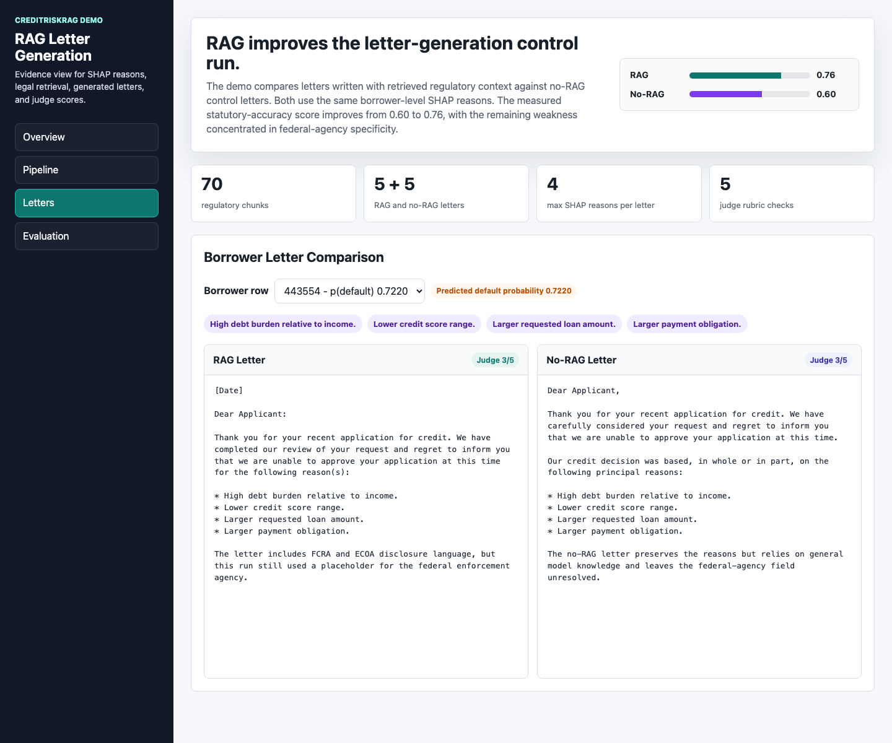<br><br>**What it shows:** Side-by-side RAG and no-RAG letters for the same borrower, using the same SHAP-selected reasons and showing the judge score for each letter. |  |


## Project Objective

The project tests whether a credit-risk workflow can produce model decisions and adverse-action-style explanations that are grounded, auditable, and policy-aware.

The original proposal framed the research question as a comparison between retrieval-grounded letters and plain LLM letters: does retrieving actual policy text produce explanations that are more faithful to model reasoning and closer to regulatory requirements than a language model with no retrieval? The current repository implements that experiment as a prototype using the selected XGBoost model, SHAP reason selection, regulatory retrieval, paired RAG/no-RAG generation, and blind rubric scoring.

Current modeling scope:

```text
Accepted loans with observed repayment outcomes
-> default-risk model
-> calibrated probability
-> economic underwriting policy
-> business recommendation
```

Implemented explanation-generation scope:

```text
Default-risk model
-> SHAP reason extraction
-> regulatory retrieval
-> adverse-action-style explanation draft
-> blind RAG vs no-RAG evaluation
```

Rejected LendingClub applications are not used as supervised default labels because they do not have observed repayment outcomes.

## Proposal Alignment And Scope

| Proposal Item | Current README / Repo Status | Notes |
| --- | --- | --- |
| Predict default risk for completed accepted loans | Implemented | The project moved from proposal framing to a full accepted-loan modeling workflow with chronological splits and final model comparison. |
| Compare RAG-grounded letters against plain LLM letters | Implemented | Five RAG and five no-RAG letters were generated and blind-judged; RAG improved overall statutory-accuracy score from `0.60` to `0.76`. |
| Use SHAP to connect predictions to borrower-level reasons | Implemented | SHAP global, local, stability, dependence, waterfall, and reason-code-family outputs are saved under `Interpretation_SHAP/shap_outputs/`. |
| Build a regulatory corpus from ECOA / Regulation B, CFPB guidance, and FCRA Section 615 | Implemented | Eight public regulatory sources were saved and chunked into `corpus/chunks.jsonl` with 70 citation-preserving chunks. |
| Use retrieval for legal grounding | Implemented | Hybrid dense + BM25 retrieval supports adverse-action-style letter drafting. LangGraph remains a possible future orchestration upgrade, not a current dependency. |
| Use DistilBERT on borrower free text | Deferred | The current production-style model intentionally avoids text fields because of privacy, proxy-risk, and explanation concerns. |
| Use a smaller DistilBERT checker for explanation faithfulness | Deferred | Current evaluation uses a blind Gemini judge and deterministic rubric items rather than a trained checker. |
| Grade generated letters with a short rubric and hand-scored examples | Implemented as prototype | `generation/judge.py` scores five binary rubric items across RAG and no-RAG outputs. |
| Address class imbalance, temporal drift, and compliance measurement limits | Covered | The current workflow uses PR-AUC, calibration, chronological validation, business policy caps, and a compliance note. |

## Architecture

### Sequence Diagram: Model Training And Evaluation

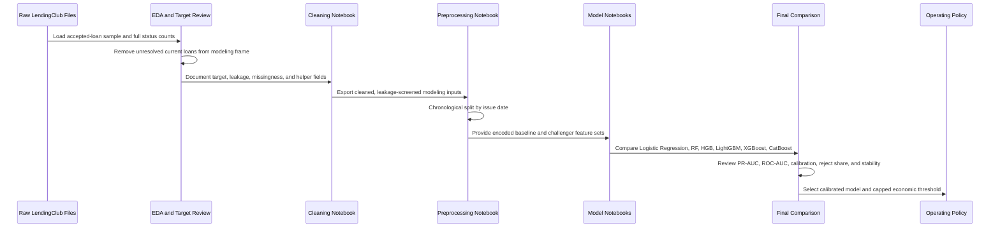

### Sequence Diagram: RAG Explanation Flow

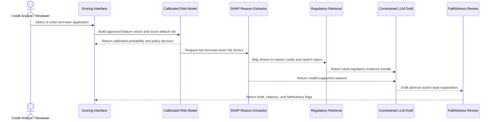

### Component Graph

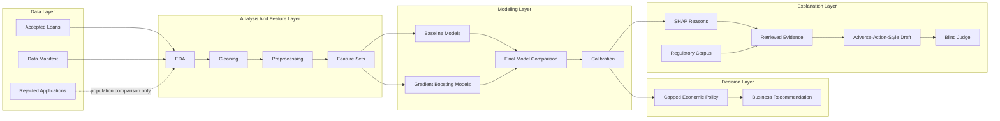

## Current Progress

| Area | Status | Primary Artifact | Engineering Note |
| --- | --- | --- | --- |
| Business framing | Complete | [Docs/Business/](Docs/Business/) | Defines accepted-loan target, underwriting workflow, and modeling business interpretation. |
| Problem research | Complete / reference | [Docs/Problem_Research/](Docs/Problem_Research/) | Summarizes LendingClub, explainability, LLM, and monitoring literature. |
| EDA | Complete / active | [EDA/Accepted_Loan_EDA.ipynb](EDA/Accepted_Loan_EDA.ipynb) | Uses accepted loans for repayment-risk analysis and logs target/leakage choices. |
| Cleaning | Complete / active | [Cleaning/Accepted_Loan_Cleaning.ipynb](Cleaning/Accepted_Loan_Cleaning.ipynb) | Preserves raw fields and creates auditable helper fields. |
| Preprocessing | Complete / active | [Modeling/Preprocessing/0_Preprocessing.ipynb](Modeling/Preprocessing/0_Preprocessing.ipynb) | Builds chronological splits and feature-set exports. |
| Baseline models | Complete | [Logistic Regression](Modeling/1_LogisticRegression_Modeling.ipynb), [Random Forest](Modeling/2_RandomForest_Modeling.ipynb), and [HistGradientBoosting](Modeling/3_HistGradientBoosting_Modeling.ipynb) | Establishes benchmark and sklearn tree baselines. |
| Gradient boosting models | Complete | [LightGBM](Modeling/4_LightGBM_Modeling.ipynb), [XGBoost](Modeling/5_XGBoost_Modeling.ipynb), and [CatBoost](Modeling/6_CatBoost_Modeling.ipynb) | Tests stronger tabular candidates. |
| Advanced model scripts | Complete | [Modeling/7_Advanced_Script_Pipeline.ipynb](Modeling/7_Advanced_Script_Pipeline.ipynb) | Notebook wrapper for reproducible advanced scripts. |
| Missingness challenger tests | Complete | [Modeling/modeling_outputs/](Modeling/modeling_outputs/) | Tests whether sparse public-record recency features add stable lift. |
| Grade/subgrade and interest-rate ablation | Complete | [Modeling/8_XGBoost_grade_IntRate_Ablation.ipynb](Modeling/8_XGBoost_grade_IntRate_Ablation.ipynb) | Confirms overlap between LendingClub grade signals and interest rate. |
| Calibration analysis | Complete | [final_model_calibration_summary.csv](Modeling/modeling_outputs/final_comparison/tables/final_model_calibration_summary.csv) | Uses Platt calibration for probability interpretation. |
| Economic operating policy | Complete | [final_model_economic_underwriting_recommendation.csv](Modeling/modeling_outputs/final_comparison/tables/final_model_economic_underwriting_recommendation.csv) | Uses capped reject/review policy instead of unconstrained best-F1. |
| Final model comparison | Complete / active | [Modeling/9_Final_Model_Comparison.ipynb](Modeling/9_Final_Model_Comparison.ipynb) | Consolidates final metrics, calibration, ablation, and policy recommendation. |
| SHAP interpretation | Complete | [Interpretation_SHAP/1_SHAP_Interpretation.ipynb](Interpretation_SHAP/1_SHAP_Interpretation.ipynb) | Explains the selected neutral XGBoost model globally and locally; exports reason-code inputs for generation. |
| Regulatory corpus | Complete | [corpus/chunks.jsonl](corpus/chunks.jsonl) and [corpus/raw/](corpus/raw/) | Uses eight public ECOA / Regulation B / FCRA / CFPB sources and 70 citation-preserving chunks. |
| Retrieval | Complete | [retrieval/build_index.py](retrieval/build_index.py) and [retrieval/hybrid_retriever.py](retrieval/hybrid_retriever.py) | Combines MiniLM dense embeddings, BM25, and Reciprocal Rank Fusion. |
| Letter generation | Complete prototype | [generation/LETTER_GENERATION_DECISION_RESULTS.md](generation/LETTER_GENERATION_DECISION_RESULTS.md) and [generation/output/](generation/output/) | Generates RAG and no-RAG adverse-action-style letters from SHAP reasons. |
| Demo | Complete | [generation/demo/rag_letter_demo.html](generation/demo/rag_letter_demo.html) | Self-contained local demo showing model-to-SHAP-to-retrieval-to-letter evaluation. |

**Collaborator handoff:** The accepted-loan credit-risk pipeline is complete through EDA, cleaning, preprocessing, model training, final model comparison, calibration, grade/subgrade and interest-rate ablation, and capped economic policy analysis. The current recommendation is a project-ready neutral XGBoost risk-ranking model for accepted loans, using `int_rate_clean` while excluding `grade` and `sub_grade`. The explanation layer is also implemented as a research prototype: SHAP extracts borrower-level reasons, mapped reasons feed RAG and no-RAG generators, regulatory retrieval grounds the RAG prompt, and a blind judge scores statutory accuracy. Remaining work is governance hardening: larger evaluation samples, deterministic agency blocks, rule-based validators, fair-lending review, and compliance approval.

## Repository Structure

```text
CreditRiskRAG/
├── Cleaning/
│   ├── Accepted_Loan_Cleaning.ipynb
│   ├── FEATURE_CLEANING_DECISIONS.md
│   └── cleaning_outputs/
├── Docs/
│   ├── Business/
│   ├── Problem_Research/
│   ├── Prompts/
│   └── REPRODUCIBILITY.md
├── EDA/
│   ├── Accepted_Loan_EDA.ipynb
│   ├── ACCEPTED_LOAN_EDA_DECISION_LOG.md
│   └── accepted_eda_outputs/
├── Interpretation_SHAP/
│   ├── 1_SHAP_Interpretation.ipynb
│   ├── SHAP_decision.md
│   ├── reason_codes/
│   └── shap_outputs/
├── Modeling/
│   ├── 00.-MODEL_PREPROCESSING_OPTIONS.md
│   ├── Preprocessing/
│   ├── 1_LogisticRegression_Modeling.ipynb
│   ├── 2_RandomForest_Modeling.ipynb
│   ├── 3_HistGradientBoosting_Modeling.ipynb
│   ├── 4_LightGBM_Modeling.ipynb
│   ├── 5_XGBoost_Modeling.ipynb
│   ├── 6_CatBoost_Modeling.ipynb
│   ├── 7_Advanced_Script_Pipeline.ipynb
│   ├── 8_XGBoost_grade_IntRate_Ablation.ipynb
│   ├── 9_Final_Model_Comparison.ipynb
│   └── modeling_outputs/
├── corpus/
│   ├── raw/
│   ├── chunk_corpus.py
│   └── chunks.jsonl
├── retrieval/
│   ├── build_index.py
│   └── hybrid_retriever.py
├── generation/
│   ├── generate_all.py
│   ├── generate_letter.py
│   ├── generate_norag.py
│   ├── judge.py
│   ├── select_reasons.py
│   ├── demo/
│   └── output/
├── scripts/
├── LCDataDictionary.xlsx
├── data_manifest.json
├── environment.yml
├── requirements.lock.txt
└── README.md
```

## Artifact Inventory By Folder

The README is intentionally not a full file listing, but these are the main folders and artifacts reviewers should know about.

| Folder | What It Contains | Key Artifacts |
| --- | --- | --- |
| `EDA/` | Accepted-loan exploratory analysis, target review, leakage audit, missingness review, and model-readiness outputs. | `Accepted_Loan_EDA.ipynb`, `ACCEPTED_LOAN_EDA_DECISION_LOG.md`, `accepted_eda_outputs/tables/accepted_safe_starter_features.csv`, `accepted_eda_outputs/tables/accepted_leakage_audit_all_raw_columns.csv`, `accepted_eda_outputs/plots/` |
| `Cleaning/` | Cleaned modeling frame creation, target extraction, traceability exports, and cleaning QA tables. | `Accepted_Loan_Cleaning.ipynb`, `FEATURE_CLEANING_DECISIONS.md`, `cleaning_outputs/datasets/accepted_cleaned_completed_frame.parquet`, `accepted_X_starter.parquet`, `accepted_y_target_bad.parquet`, `accepted_traceability.parquet` |
| `Modeling/Preprocessing/` | Chronological train/validation/test split, feature-set exports, encoding manifests, and preprocessing QA. | `0_Preprocessing.ipynb`, `preprocessing_outputs/datasets/*_train_X.parquet`, `*_validation_X.parquet`, `*_test_X.parquet`, `preprocessing_outputs/tables/preprocessing_feature_set_summary.csv`, `preprocessing_split_summary.csv` |
| `Modeling/modeling_outputs/` | Model artifacts, candidate rankings, selected metrics, review-volume precision, calibration analysis, and final comparison tables/plots. | `final_comparison/tables/final_model_recommendation.csv`, `final_model_selected_metrics.csv`, `final_model_calibration_summary.csv`, `final_model_economic_underwriting_recommendation.csv`, `final_comparison/plots/` |
| `Modeling/modeling_outputs/*/models/` | Saved selected model artifacts for baseline, tuned, challenger, and ablation runs. | `*.joblib` selected models for Logistic Regression, Random Forest, HistGradientBoosting, LightGBM, XGBoost, CatBoost, neutral XGBoost, and PR-AUC optimized runs |
| `Interpretation_SHAP/` | SHAP interpretation for the preferred neutral XGBoost model, including global importance, local examples, stability checks, and draft reason-code mapping. | `1_SHAP_Interpretation.ipynb`, `shap_outputs/tables/shap_global_mean_abs_importance.csv`, `shap_outputs/tables/shap_local_examples.csv`, `reason_codes/draft_reason_code_mapping.csv`, `shap_outputs/plots/` |
| `corpus/` | Regulatory source files and citation-preserving chunks for adverse-action-style retrieval. | `raw/*.html`, `chunk_corpus.py`, `chunks.jsonl`, `README.md` |
| `retrieval/` | Hybrid legal retriever using dense MiniLM embeddings, BM25 lexical retrieval, and Reciprocal Rank Fusion. | `build_index.py`, `hybrid_retriever.py`, `diagnose.py` |
| `generation/` | SHAP reason selection, RAG generation, no-RAG baseline generation, blind judging, aggregate results, and self-contained demo. | `select_reasons.py`, `generate_all.py`, `generate_letter.py`, `generate_norag.py`, `judge.py`, `output/results.md`, `LETTER_GENERATION_DECISION_RESULTS.md`, `demo/rag_letter_demo.html` |
| `Docs/Business/` | Business framing and collaborator-facing interpretation. | Loan-status interpretation, consumer-credit underwriting workflow, and modeling business summary |
| `Docs/Problem_Research/` | Literature review and project references. | `Papers.md`, `Paper_Reading_Summary.md` |
| `scripts/` | Reproducibility checks and advanced modeling/policy scripts used by the notebook pipeline. | `reproducibility_check.py`, `run_missingness_challenger_all_models.py`, `run_pr_auc_optimized_advanced_models.py`, `test_xgboost_grade_int_rate_combinations.py`, `create_economic_underwriting_policy.py` |
| `../Others/ProjectProposalDrafts/` | Original and revised project proposal drafts, PDF evaluation, LaTeX source, and final one-page proposal PDF. | `FinalProposal/Project_Proposal_2_Revised.pdf`, `Project_Proposal_2_Revised.tex`, `Project_Proposal_2_PDF_Evaluation.md` |
| `../Others/Repo/` | GitHub collaboration and repository safety notes. | `GIT_COLLABORATOR_WORKFLOW.md`, `GITHUB_SAFETY_CONFIGURATION.md` |
| `../Others/video/` | Underwriting workflow explainer video materials. | `underwriting_workflow_explainer/storyboard.md`, `consumer_credit_underwriting_explainer.mp4` |
| `../Others/POSSIBLE_RISKS.md` | Supplemental risk log from dataset and project review. | Dataset freshness, source/TOS uncertainty, leakage, censoring, selection bias, and fair-lending/proxy-risk notes |

## Data

The project uses Kaggle LendingClub accepted and rejected loan files from 2007 through 2018 Q4. Raw files are expected outside this project folder:

```text
Final/Data/archive/
├── accepted_2007_to_2018Q4.csv.gz
└── rejected_2007_to_2018Q4.csv.gz
```

| File | Role | Modeling Use |
| --- | --- | --- |
| `accepted_2007_to_2018Q4.csv.gz` | Originated loans with repayment outcomes and loan/account attributes. | Used for supervised default modeling after target and leakage review. |
| `rejected_2007_to_2018Q4.csv.gz` | Rejected applications without repayment outcomes. | Not used as supervised default labels; useful only for population comparison or demo context. |
| `data_manifest.json` | Expected file paths, SHA256 checksums, and headers. | Source of truth for data preflight checks. |
| `LCDataDictionary.xlsx` | LendingClub field definitions. | Reference for feature meaning and timing review. |

### Dataset Scope Reconciliation

The one-page proposal described an earlier LendingClub project scope of about 890,000 loans and roughly 75 fields. The current repository uses the larger accepted-loan file available in this workspace and documents its actual schema through EDA and `data_manifest.json`.

| Source | Scope Stated / Used | README Interpretation |
| --- | --- | --- |
| Revised project proposal | About 890,000 LendingClub loans and roughly 75 features. | Historical proposal framing; useful for intent but not the current source-of-truth counts. |
| Current accepted-loan EDA | 2,260,701 raw accepted-loan rows and 151 columns; 250,000-row reproducible EDA sample. | Current implementation scope for accepted-loan modeling and full loan-status scans. |
| Current modeling target | Completed accepted loans after target/censoring filters. | Supervised model estimates default risk for originated loans with observed repayment outcomes. |
| Rejected applications | Rejected applicant records without repayment outcomes. | Not used as supervised default labels. |

## Reproducibility

Reproducibility is treated as a project requirement, not an afterthought.

| Control | Rule |
| --- | --- |
| Raw data | Keep raw LendingClub files unchanged under `Final/Data/archive/`. |
| Manifest | Validate file paths, headers, and SHA256 hashes from `data_manifest.json`. |
| Environment | Use Python 3.11 and install from `requirements.lock.txt` or `environment.yml`. |
| Randomness | Use fixed seeds for sampling, splits, and stochastic model steps. |
| Sampling | EDA uses a reproducible 250,000-row accepted-loan sample for exploration. |
| Validation | Use chronological issue-date splits as the primary estimate. |
| Leakage control | Use reviewed feature lists; do not infer final model columns automatically. |
| Auditability | Keep raw and cleaned helper fields side by side where possible. |

Run the strict preflight:

```bash
python scripts/reproducibility_check.py
```

Run a faster development check:

```bash
python scripts/reproducibility_check.py --skip-package-check --skip-hash-check
```

## Installation

Use Python 3.11.

Quick start with `venv`:

```bash
git clone https://github.com/lindaperez/CreditRiskRAG.git
cd CreditRiskRAG
python3.11 -m venv .venv
source .venv/bin/activate
python -m pip install --upgrade pip
python -m pip install -r requirements.lock.txt
```

### venv

```bash
python3.11 -m venv .venv
source .venv/bin/activate
python -m pip install --upgrade pip
python -m pip install -r requirements.lock.txt
python -m ipykernel install --user --name credit-risk-rag --display-name "Python (credit-risk-rag)"
```

### Conda

```bash
cd Final/CreditRiskRAG
conda env create -f environment.yml
conda activate credit-risk-rag
python -m ipykernel install --user --name credit-risk-rag --display-name "Python (credit-risk-rag)"
```

Primary packages:

| Package | Version / Role |
| --- | --- |
| Python | `3.11` |
| pandas | `2.2.2` |
| scikit-learn | `1.5.2` |
| XGBoost | Gradient boosting model |
| LightGBM | Gradient boosting challenger |
| CatBoost | Categorical boosting challenger |
| Jupyter / ipykernel | Notebook execution |

## EDA Key Decisions

| Area | Decision | Rationale |
| --- | --- | --- |
| Population | Use accepted/originated LendingClub loans for supervised modeling. | Repayment outcomes are observable only for originated loans. |
| Working sample | Use a reproducible 250,000-row EDA sample and full-file loan-status scans. | Keeps exploration efficient while preserving full-target distribution evidence. |
| Current loans | Remove `loan_status == "Current"` from modeling-oriented EDA. | Current loans are active/censored and do not have final repayment outcomes. |
| Target | Create `target_bad` from completed outcomes only. | Avoids treating unresolved loans as good outcomes. |
| Leakage | Exclude post-origination servicing, payment, recovery, hardship, settlement, last-FICO, and last-credit-pull fields. | These fields are unavailable at application time and inflate performance. |
| Missingness | Treat structural missingness separately from random missingness. | Joint-applicant and delinquency-recency fields can be missing for business reasons. |
| Validation | Use chronological issue-date splits. | Borrower mix, pricing policy, and macro conditions change over time. |
| Starter features | Begin with leakage-screened application-time and credit-bureau style features. | Creates a defensible baseline before adding sparse or policy-sensitive fields. |

## Cleaning Key Decisions

| Area | Decision | Rationale |
| --- | --- | --- |
| Raw fields | Preserve raw source columns and add helper fields. | Keeps lineage from LendingClub values to model-ready values. |
| Percent fields | Parse `int_rate` and `revol_util` into numeric helper columns. | Supports numeric modeling while preserving raw strings. |
| Terms and employment | Convert `term` to `term_months` and `emp_length` to `emp_length_years`. | Produces stable model-ready numeric features. |
| FICO ranges | Use `fico_mean` from low/high FICO endpoints. | Reduces duplicated range fields into one interpretable signal. |
| Dates | Parse `issue_d` and `earliest_cr_line`; derive credit-history age. | Avoids raw date leakage and creates a borrower-tenure feature. |
| Identifiers | Exclude `id`, `member_id`, and `url` from model features. | Prevents memorization and lookup leakage. |
| Text fields | Exclude `emp_title`, `desc`, and `title` from the baseline. | Text carries privacy, proxy, cardinality, and explanation risks. |
| Geography | Treat `zip_code` and `addr_state` as proxy-risk fields requiring separate review. | Geography can create fair-lending and reason-code concerns. |

## Preprocessing Key Decisions

| Area | Decision | Rationale |
| --- | --- | --- |
| Split order | Split chronologically before fitting imputers or encoders. | Prevents future-period leakage through preprocessing. |
| Baseline features | Exclude `mths_since_last_record` from the baseline. | It is about 83% missing and belongs in a challenger test. |
| Missing indicators | Add indicators for `mths_since_last_delinq` and optionally `emp_length_years`. | Missingness can carry credit-file information. |
| Numeric imputation | Fit median imputers on train only. | More robust for skewed income, balance, and utilization variables. |
| Categorical imputation | Fill missing categories as `Missing`. | Keeps missingness explicit and auditable. |
| Encoding | One-hot encode low-cardinality categoricals for sklearn models. | Supports linear models and sklearn tree baselines. |
| Scaling | Apply scaling where required by model family. | Logistic regression needs it; tree models generally do not. |
| Evaluation | Report ROC-AUC, PR-AUC, calibration, fixed-volume precision, capped economic policy, and confusion matrices. | Accuracy alone is not enough for imbalanced credit risk. |

## Notebook And Pipeline Order

Run the modeling notebooks in numeric order, then run interpretation and generation artifacts.

| Step | Notebook |
| ---: | --- |
| 0 | `Modeling/Preprocessing/0_Preprocessing.ipynb` |
| 1 | `Modeling/1_LogisticRegression_Modeling.ipynb` |
| 2 | `Modeling/2_RandomForest_Modeling.ipynb` |
| 3 | `Modeling/3_HistGradientBoosting_Modeling.ipynb` |
| 4 | `Modeling/4_LightGBM_Modeling.ipynb` |
| 5 | `Modeling/5_XGBoost_Modeling.ipynb` |
| 6 | `Modeling/6_CatBoost_Modeling.ipynb` |
| 7 | `Modeling/7_Advanced_Script_Pipeline.ipynb` |
| 8 | `Modeling/8_XGBoost_grade_IntRate_Ablation.ipynb` |
| 9 | `Modeling/9_Final_Model_Comparison.ipynb` |
| 10 | `Interpretation_SHAP/1_SHAP_Interpretation.ipynb` |

Step 7 wraps advanced scripts in a notebook so collaborators can reproduce the workflow without manually running terminal commands. Step 9 runs `scripts/create_operating_policy_analysis.py` internally.

After SHAP outputs exist, run the explanation pipeline:

| Step | Command / Artifact |
| ---: | --- |
| 11 | `python corpus/chunk_corpus.py` |
| 12 | `python retrieval/build_index.py` |
| 13 | `python generation/select_reasons.py` |
| 14 | `python generation/generate_all.py` |
| 15 | `python generation/generate_norag.py` |
| 16 | `python generation/judge.py` |
| 17 | `python generation/results.py` |
| 18 | Open `generation/demo/rag_letter_demo.html` |

## Implementation Scripts

| Script | Purpose |
| --- | --- |
| `scripts/reproducibility_check.py` | Validates environment, raw data files, file hashes, headers, and notebook reproducibility markers. |
| `scripts/create_missingness_no_grade_subgrade_dataset.py` | Builds the missingness challenger feature set without `grade` and `sub_grade`. |
| `scripts/run_missingness_challenger_all_models.py` | Runs missingness challenger experiments across model families. |
| `scripts/run_missingness_no_grade_subgrade_all_models.py` | Runs missingness challenger experiments with grade/subgrade removed. |
| `scripts/run_pr_auc_optimized_advanced_models.py` | Runs PR-AUC optimized advanced model candidates. |
| `scripts/review_xgboost_class_weighting.py` | Compares weighted vs neutral XGBoost probability behavior. |
| `scripts/tune_neutral_xgboost_missingness_challenger.py` | Tunes neutral XGBoost on the missingness challenger feature set. |
| `scripts/tune_neutral_xgboost_no_grade_subgrade.py` | Tunes neutral XGBoost with `grade` and `sub_grade` removed. |
| `scripts/test_xgboost_grade_int_rate_combinations.py` | Runs grade/subgrade and interest-rate ablation experiments. |
| `scripts/create_calibration_analysis.py` | Produces calibration analysis outputs. |
| `scripts/create_economic_underwriting_policy.py` | Builds capped economic underwriting policy outputs. |
| `scripts/create_operating_policy_analysis.py` | Creates final operating policy analysis used by the final comparison notebook. |
| `scripts/generate_advanced_scripts_pipeline_notebook.py` | Generates the notebook wrapper for advanced script execution. |
| `corpus/chunk_corpus.py` | Cleans and chunks regulatory HTML/TXT sources into citation-preserving JSONL chunks. |
| `retrieval/build_index.py` | Builds the dense retrieval index over regulatory chunks. |
| `retrieval/hybrid_retriever.py` | Runs hybrid dense/BM25 retrieval with Reciprocal Rank Fusion. |
| `generation/select_reasons.py` | Converts local SHAP drivers into capped, mapped, applicant-readable draft reasons. |
| `generation/generate_all.py` | Runs paired RAG generation for selected borrowers. |
| `generation/generate_norag.py` | Runs the no-RAG control generation from the same SHAP reasons. |
| `generation/judge.py` | Runs blind statutory-accuracy judging across shuffled RAG/no-RAG letters. |
| `generation/results.py` | Aggregates judge output into JSON and Markdown result summaries. |

## Modeling Key Decisions

| Decision | Choice | Reason |
| --- | --- | --- |
| Model selection objective | Optimize for risk ranking, calibration, and usable operating policy. | Highest F1 can produce unrealistic over-rejection. |
| Preferred model family | XGBoost. | Strong tabular performance and mature explainability support. |
| Class weighting | Use neutral `scale_pos_weight=1`. | Weighted XGBoost had nearly unchanged ranking but distorted raw probabilities. |
| Calibration | Use Platt calibration. | Improves probability interpretation while preserving ranking behavior. |
| Feature policy | Remove `grade` and `sub_grade`; keep `int_rate_clean`. | Keeps nearly identical predictive performance while avoiding explicit LendingClub grade buckets. |
| Operating threshold | Use capped economic policy with about 20% maximum reject/review share. | Prevents the best-F1 threshold from rejecting roughly 45% to 50% of applicants. |
| Evaluation metrics | Use PR-AUC, ROC-AUC, calibration, reject share, rejected bad rate, approved bad rate, and estimated economic value. | Captures class imbalance, probability quality, and business impact. |
| RAG boundary | Generate regulatory explanations only from selected SHAP reasons and retrieved evidence. | Prevents fluent explanations from inventing unsupported borrower reasons or legal claims. |

## Modeling Results: Top 20% And Capped Economic Policy

The final modeling result separates statistical ranking from operational deployment. The best-F1 operating point is useful for model comparison, but it rejects too much of the population for a realistic underwriting workflow. The final recommendation therefore emphasizes two practical views: the top-20% risk-review segment and a capped economic policy.

| Result Area | Decision / Result | Supporting Artifact |
| --- | --- | --- |
| Model family comparison | Gradient boosting models outperform simpler baselines for default-risk ranking; XGBoost is preferred because it combines strong ranking, stable governance tradeoffs, and SHAP support. | [final_model_selected_metrics.csv](Modeling/modeling_outputs/final_comparison/tables/final_model_selected_metrics.csv) |
| Calibration | Platt calibration materially improves probability interpretation compared with raw weighted XGBoost probabilities. | [final_model_calibration_summary.csv](Modeling/modeling_outputs/final_comparison/tables/final_model_calibration_summary.csv) |
| Top-20% review policy | The highest-risk 20% review group has about a 40% observed bad rate, roughly 1.9x the test-period base bad rate. | [final_model_top_pr_auc_fixed_review_volume_policy.csv](Modeling/modeling_outputs/final_comparison/tables/final_model_top_pr_auc_fixed_review_volume_policy.csv) |
| Capped economic policy | Use capped economic underwriting with about a 20% maximum reject/review share instead of unconstrained best-F1 rejection. | [final_model_economic_underwriting_recommendation.csv](Modeling/modeling_outputs/final_comparison/tables/final_model_economic_underwriting_recommendation.csv) |
| Feature governance | Remove explicit LendingClub `grade` and `sub_grade`; keep `int_rate_clean` because the performance difference is negligible and the feature policy is simpler. | [final_model_grade_subgrade_ablation_metrics.csv](Modeling/modeling_outputs/final_comparison/tables/final_model_grade_subgrade_ablation_metrics.csv) |
| Preferred model | `xgb_neutral_09_without_grade_subgrade_with_int_rate` with test PR-AUC `0.380806`, top-20% bad rate `40.09%`, default capture `38.13%`, and estimated capped-policy value `$123,907,500`. | [final_model_recommendation_with_feature_set_label.csv](Modeling/modeling_outputs/final_comparison/tables/final_model_recommendation_with_feature_set_label.csv) |

### Top-20% Risk Review Result

The top-20% review policy asks a fixed-capacity business question: if the lender can review only the highest-risk 20% of accepted loans, how concentrated are defaults in that segment?

| Metric | Result | Interpretation |
| --- | ---: | --- |
| Test rows | `195,749` | Held-out future-period accepted loans. |
| Review group size | `39,150` | Top 20% highest-risk accepted loans. |
| Captured defaults | `15,704` | Defaults found inside the top-20% risk queue. |
| Bad rate in top-20% group | `40.11%` | The review queue is much riskier than the base portfolio. |
| Test-period base bad rate | `21.03%` | Overall bad-loan rate in the held-out test period. |
| Lift over base bad rate | `1.91x` | Top-20% review nearly doubles default concentration. |
| Default capture / recall | `38.15%` | The top-20% queue captures about 38% of all defaults. |

### Capped Economic Policy Result

The capped economic policy asks a deployment question: what threshold maximizes estimated value while preventing the model from rejecting or reviewing too many applicants?

| Metric | Result | Interpretation |
| --- | ---: | --- |
| Calibration method | `Platt sigmoid` | Converts raw scores into more usable risk probabilities. |
| Selected threshold | `0.365439` | Calibrated probability cutoff selected on validation and applied to test. |
| Maximum reject/review cap | `20%` | Business constraint to avoid unconstrained over-rejection. |
| Actual reject/review share | `19.47%` | Test-period share flagged by the capped policy. |
| Rejected/reviewed count | `38,107` | Number of test-period loans flagged by the policy. |
| Approved count | `157,642` | Number of test-period loans not flagged. |
| Bad rate among rejected/reviewed loans | `40.44%` | Risk concentration inside the flagged group. |
| Approved bad rate | `16.34%` | Remaining portfolio bad rate after the capped review action. |
| Defaults caught | `15,409` | Bad loans captured by the capped economic policy. |
| Estimated portfolio value | `$120,043,000` | Value under example assumptions: `+$10,000` per caught default, `-$1,500` per rejected good borrower. |
| Value per applicant | `$613.25` | Estimated value normalized by test-period applicant count. |

### Graphs Supporting Modeling Results

These plots are produced by the final comparison notebook and supporting modeling scripts. They are grouped two per row for readability.

| Model Ranking Evidence | Discrimination Evidence |
| --- | --- |
| 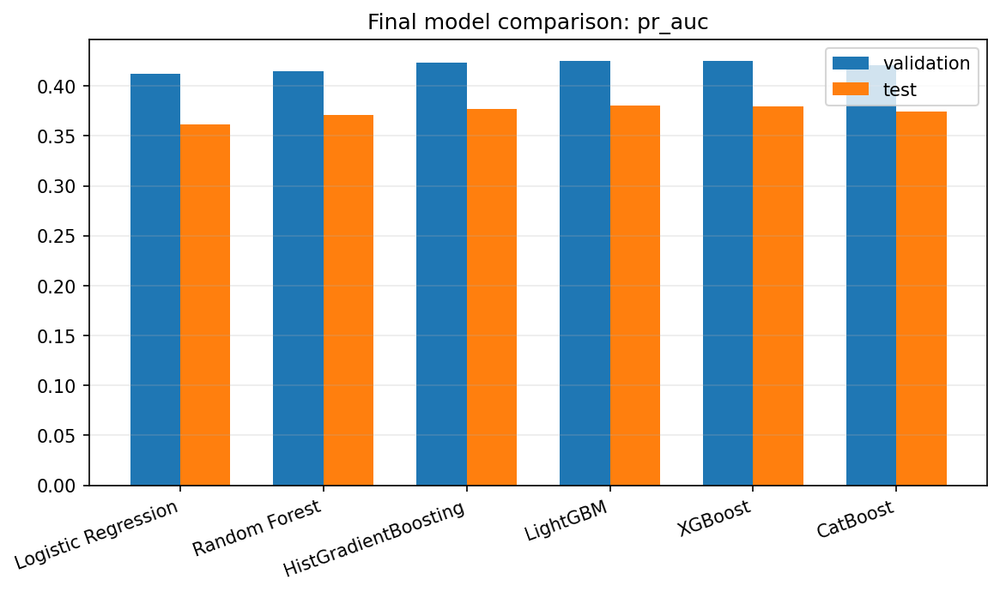<br><br>**Interpretation:** PR-AUC is the main ranking metric because defaults are the minority class. The plot shows which model families concentrate bad loans most effectively near the top of the risk ranking. | 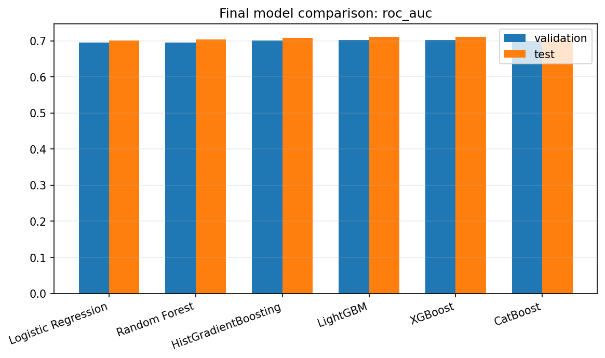<br><br>**Interpretation:** ROC-AUC confirms broad separation between good and bad loans. It supports the same model-family comparison, but PR-AUC remains more important for imbalanced credit risk. |
| 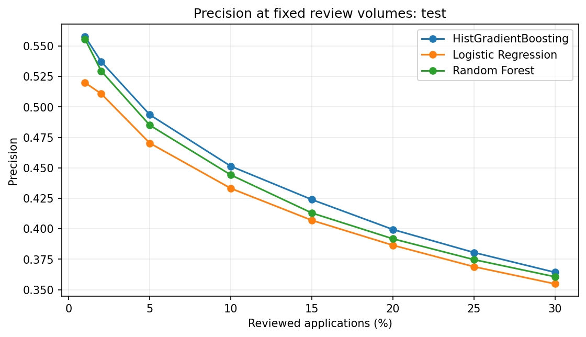<br><br>**Interpretation:** Precision falls as review volume increases, which is expected. The top-20% policy is a practical compromise: enough volume to capture meaningful defaults while keeping the review/reject queue operationally bounded. | 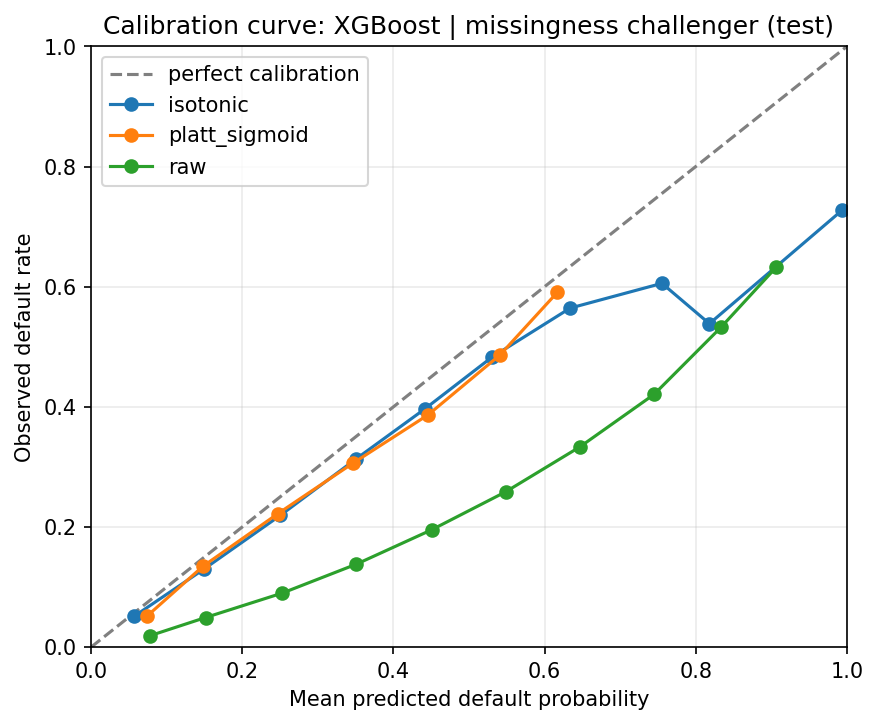<br><br>**Interpretation:** Calibration checks whether predicted probabilities can support threshold decisions. This plot supports using calibrated probabilities before applying the capped economic policy. |
| 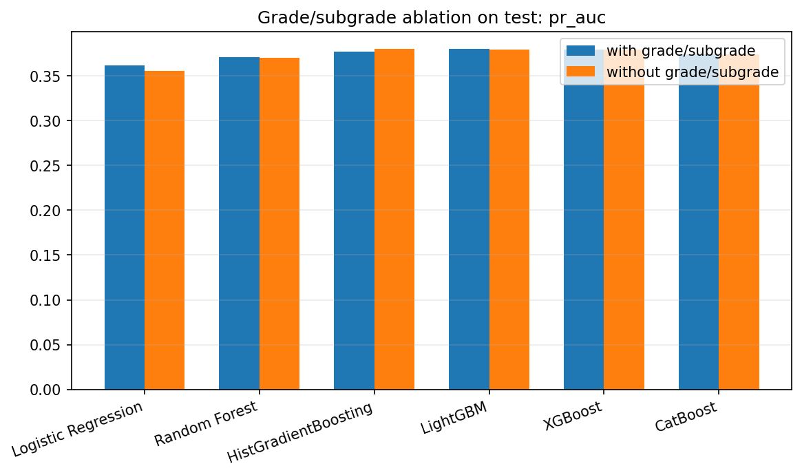<br><br>**Interpretation:** The ablation shows that explicit `grade` and `sub_grade` can be removed with little performance loss when `int_rate_clean` is retained. This supports the final feature-governance decision. |  |

## Recommended Model

Preferred production-style model:

```text
xgb_neutral_09_without_grade_subgrade_with_int_rate
```

Recommended policy:

- Use neutral XGBoost with `scale_pos_weight=1`.
- Exclude `grade` and `sub_grade`.
- Keep `int_rate_clean`.
- Use Platt calibration before probability-based decisions.
- Use a capped economic underwriting policy instead of the automated best-F1 threshold.
- Apply a maximum reject/review cap around 20%.

## Grade/Subgrade And Interest-Rate Ablation

This section answers a business governance question: does the model need LendingClub's explicit `grade` and `sub_grade` fields, or can it perform just as well with borrower/application information plus the loan's interest rate?

| Experiment | Feature Policy | Validation PR-AUC | Test PR-AUC | Test Reject Share | Estimated Value |
| --- | --- | ---: | ---: | ---: | ---: |
| A | Keep `grade/sub_grade` and keep `int_rate_clean` | `0.426323` | `0.380704` | `20.13%` | `$121,918,500` |
| B | Remove `grade/sub_grade`, keep `int_rate_clean` | `0.426423` | `0.380806` | `20.49%` | `$123,907,500` |
| C | Keep `grade/sub_grade`, remove `int_rate_clean` | `0.426470` | `0.381304` | `19.92%` | `$120,834,000` |
| D | Remove `grade/sub_grade` and remove `int_rate_clean` | `0.422215` | `0.375358` | `20.49%` | `$121,606,000` |

### How To Read These Metrics

| Metric | Plain-English Meaning | Business Interpretation |
| --- | --- | --- |
| Validation PR-AUC | How well the model ranked likely bad loans above good loans on the tuning period, focusing on the default class. | Useful because defaults are the minority class. Higher PR-AUC means the review queue is more concentrated with risky loans. |
| Test PR-AUC | Same ranking metric on the held-out future period. | Shows whether the model generalizes beyond the period used for selection. |
| Test Reject Share | Share of accepted-loan records that would be flagged for decline/review under the capped policy. | Keeps the policy operationally realistic. A very high reject share can be unacceptable even if a metric improves. |
| Rejected Bad Rate / Top-20% Bad Rate | Among the loans the model flags as riskiest, the share that actually became bad. | Measures whether the model is useful for prioritizing manual review or risk mitigation. |
| Default Capture | Share of all bad loans captured inside the review/reject group. | Measures how much portfolio risk the policy catches at a fixed review capacity. |
| Estimated Value | Dollar value from the assumed policy framework. | Converts model ranking into a business decision tradeoff between avoided default loss and lost good-loan revenue. |

PR-AUC is more important than accuracy here because most accepted loans do not default. A model can look accurate by mostly predicting "good loan," but that would not help a lender find the smaller group of loans that create most credit losses. PR-AUC asks a harder and more relevant question: when the model assigns high risk, are those loans truly enriched for defaults?

### Business Insights And Conclusions

| Insight | Conclusion |
| --- | --- |
| `grade/sub_grade` and `int_rate_clean` carry overlapping risk information. | Keeping both does not materially improve model performance. |
| Removing only `grade/sub_grade` keeps performance effectively unchanged. | The preferred model can avoid explicit LendingClub grade buckets while still using `int_rate_clean`, which is available on funded accepted loans. |
| Removing both grade signals and interest rate creates the only meaningful decline. | LendingClub pricing/risk information is useful, but one pricing/risk signal is enough for this project. |
| The strict statistical winner is not the best business choice. | Experiment C has the highest validation PR-AUC by only `0.000047`, which is too small to justify a less defensible feature policy. |
| The preferred model has a test PR-AUC of `0.380806` and a top-20% rejected bad rate of `40.09%`. | The model can concentrate risk: the highest-risk 20% contains a much higher bad-loan rate than the overall accepted-loan population. |
| The capped economic policy avoids best-F1 over-rejection. | The model is useful as a controlled review/risk-ranking tool, not as an unconstrained automated rejection engine. |

The ablation study shows that `grade/sub_grade` and `int_rate_clean` provide highly overlapping LendingClub pricing/risk information. Including both did not improve performance. Removing both produced the only noticeable decline, but the model still performed reasonably well using borrower and loan application features alone.

The strict statistical winner was experiment C, but its validation PR-AUC advantage over the preferred model was only `0.000047`. The preferred model removes explicit LendingClub grade labels, keeps `int_rate_clean`, and is more defensible for governance and parsimony.

## Business Usefulness For Accepted Loans

The current model is useful for accepted/funded LendingClub loans with observed repayment outcomes. At this stage, it is best interpreted as a project-ready risk-ranking and policy-analysis model: the modeling workflow is complete enough to support the final project recommendation, while production lending use would require additional validation and governance.

| Stakeholder | How The Model Is Useful Today |
| --- | --- |
| Credit risk team | Prioritizes accepted loans by estimated default risk and identifies the riskiest segment for review. |
| Portfolio / finance team | Compares the expected value of different review caps and threshold policies. |
| Model governance reviewers | Shows how feature choices affect performance and defensibility, especially around `grade`, `sub_grade`, and `int_rate_clean`. |
| Data science collaborators | Provides a reproducible benchmark across Logistic Regression, Random Forest, HistGradientBoosting, LightGBM, XGBoost, and CatBoost. |
| Compliance / policy reviewers | Provides a controlled prototype for reason-code and adverse-action-style explanation review, while clearly separating research from approved lending use. |
| Instructors / evaluators | Demonstrates leakage control, chronological validation, calibration, ablation testing, and business-metric interpretation. |

Under the preferred model and capped policy, the highest-risk 20% review group has an observed bad rate around `40.09%` on the test period and captures about `38.13%` of defaults. In business terms, the model gives stakeholders a defensible way to focus limited review capacity on the accepted loans where credit losses are most concentrated.

### Current Readiness

| Readiness Area | Status |
| --- | --- |
| Final project risk model | Ready for project reporting and business interpretation. |
| Reproducible modeling workflow | Ready: EDA, cleaning, preprocessing, model comparison, calibration, and policy analysis are documented. |
| Portfolio risk-ranking use case | Ready as a research/prototype decision-support workflow for accepted loans. |
| Production lending deployment | Not ready without independent validation, monitoring design, fair-lending review, reason-code governance, and compliance approval. |
| Rejected-applicant default prediction | Out of scope because rejected applications do not have observed repayment labels in this dataset. |
| RAG adverse-action-style generation | Complete as a small-sample research prototype; not compliance-approved. |

## SHAP Interpretation Results

SHAP interpretation is implemented for the preferred model:

```text
xgb_neutral_09_without_grade_subgrade_with_int_rate
```

The notebook `Interpretation_SHAP/1_SHAP_Interpretation.ipynb` explains a reproducible 5,000-row validation sample and compares the explanation ranking against the held-out test period. Outputs are saved under `Interpretation_SHAP/shap_outputs/` and `Interpretation_SHAP/reason_codes/`.

### Global SHAP Drivers

| Rank | Feature | mean\|SHAP\| | Interpretation |
| ---: | --- | ---: | --- |
| 1 | `int_rate_clean` | `0.393` | Dominant accepted-loan pricing/risk signal. |
| 2 | `term_months` | `0.246` | Longer terms increase modeled risk. |
| 3 | `acc_open_past_24mths` | `0.164` | More recently opened accounts increase modeled risk. |
| 4 | `dti` | `0.116` | Higher debt burden increases modeled risk. |
| 5 | `fico_mean` | `0.098` | Higher FICO lowers modeled risk. |
| 6 | `annual_inc` | `0.082` | Higher income lowers modeled risk. |
| 7 | `loan_amnt` | `0.079` | Larger requested loan amount contributes to risk. |

The top drivers are stable: validation-vs-test SHAP rank correlation is `0.9987`, and the top six features have zero rank shift. Local examples include 75 high-risk and 75 low-risk accepted loans for downstream letter-generation evaluation.

### Graphs Supporting SHAP Results

These plots are produced by `Interpretation_SHAP/1_SHAP_Interpretation.ipynb`. They are grouped two per row for readability.

| Global Importance Evidence | Direction And Distribution Evidence |
| --- | --- |
| 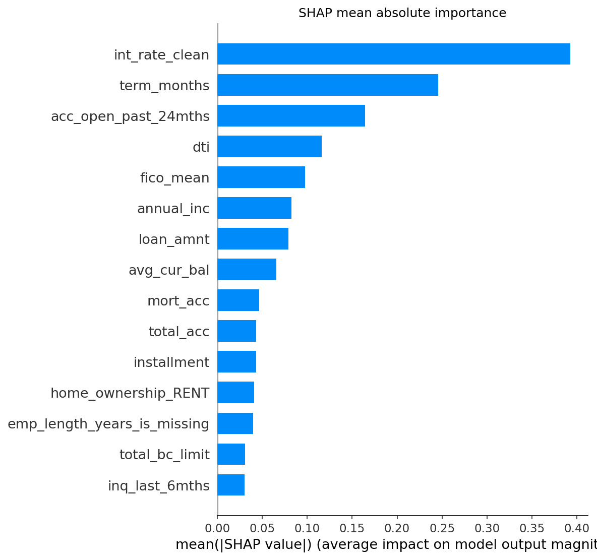<br><br>**Interpretation:** `int_rate_clean`, `term_months`, recent account openings, DTI, FICO, income, and loan amount are the largest contributors to model behavior. This supports the reason-code families used downstream for letter generation. | 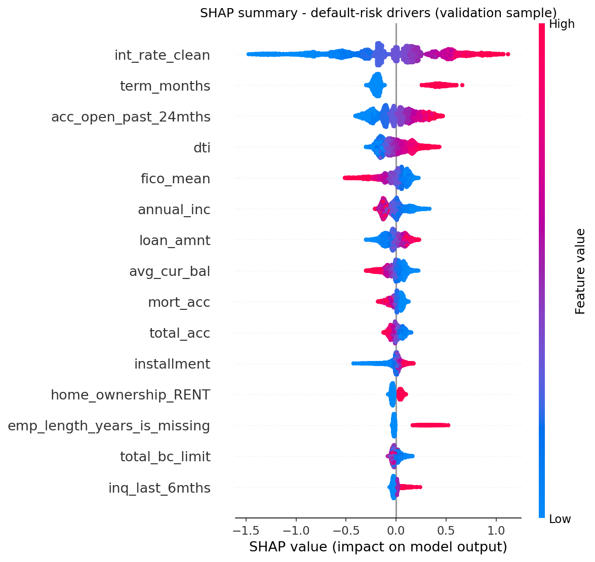<br><br>**Interpretation:** The beeswarm shows both magnitude and direction of borrower-level effects. Higher-risk patterns cluster around pricing/risk, longer terms, recent credit activity, debt burden, and weaker credit profile signals. |
| 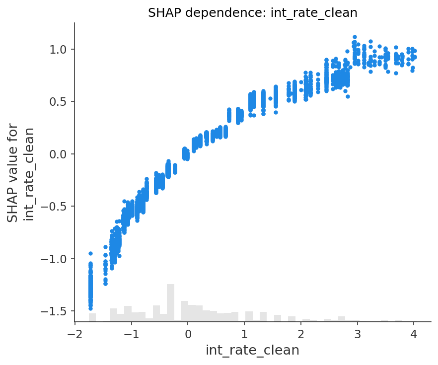<br><br>**Interpretation:** Interest rate is the strongest accepted-loan pricing/risk signal. Higher values generally push predictions toward higher modeled default risk, which is why the project treats it as a governance-sensitive feature. | 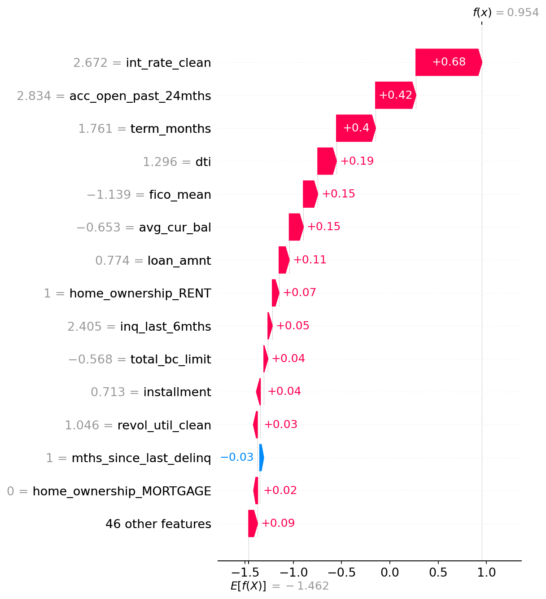<br><br>**Interpretation:** The waterfall shows how individual borrower features move one high-risk prediction away from the baseline. It demonstrates how local SHAP drivers become deterministic candidate reasons before RAG letter drafting. |

### Reason-Code Mapping

`draft_reason_code_mapping.csv` maps technical drivers into draft human-readable reason families. Mapped SHAP importance is concentrated in:

| Reason Family | Share Of Mapped SHAP Importance |
| --- | ---: |
| Higher-priced loan / accepted-loan pricing risk signal | `29%` |
| Longer loan repayment term | `18%` |
| Multiple credit accounts opened in the past 24 months | `12%` |
| High debt burden relative to income | `9%` |
| Lower credit score range | `7%` |
| Lower reported income relative to requested credit | `6%` |
| Larger requested loan amount | `6%` |

Important interpretation boundary: SHAP explains model behavior. It is not, by itself, a legally approved adverse-action explanation. Geography and home-ownership features remain flagged for fair-lending and applicant-facing review.

## Corpus And Retrieval Results

The regulatory corpus is implemented from eight public U.S. sources relevant to adverse-action notices:

| Source File | Citation |
| --- | --- |
| `reg_b_1002_2.html` | 12 CFR 1002.2 |
| `reg_b_1002_9.html` | 12 CFR 1002.9 |
| `reg_b_appendix_a.html` | 12 CFR pt.1002 App. A |
| `reg_b_appendix_c.html` | 12 CFR pt.1002 App. C |
| `reg_b_supplement_i_9.html` | 12 CFR pt.1002 Supp. I, comment 9 |
| `fcra_615.html` | 15 USC 1681m, FCRA 615 |
| `cfpb_circular_2022_03.html` | CFPB Circular 2022-03 |
| `cfpb_circular_2023_03.html` | CFPB Circular 2023-03 |

`corpus/chunk_corpus.py` produces `corpus/chunks.jsonl` with 70 citation-preserving chunks. `retrieval/build_index.py` embeds the chunks with `sentence-transformers/all-MiniLM-L6-v2`, and `retrieval/hybrid_retriever.py` combines dense cosine retrieval, BM25 lexical retrieval, and Reciprocal Rank Fusion.

## Letter Generation Results

Letter generation is implemented as a controlled RAG-vs-no-RAG experiment:

[View generated letters in the local demo](generation/demo/rag_letter_demo.html)

| Stage | Implementation |
| --- | --- |
| Borrower reasons | `generation/select_reasons.py` selects positive SHAP drivers from mapped reason codes. |
| RAG generator | `generation/generate_letter.py` drafts letters using selected SHAP reasons and retrieved legal chunks. |
| No-RAG control | `generation/generate_norag.py` drafts from the same reasons without retrieved legal text. |
| Batch run | `generation/generate_all.py` produces paired outputs. |
| Blind judge | `generation/judge.py` shuffles outputs and scores statutory accuracy. |
| Results | `generation/output/results.json`, `generation/output/results.md`, and `generation/LETTER_GENERATION_DECISION_RESULTS.md`. |

## Letter Generation Evaluation

The letter-generation evaluation tests whether retrieval improves statutory accuracy, not just whether the letter sounds complete. RAG and no-RAG letters are generated from the same SHAP-selected borrower reasons, then judged blindly after the records are shuffled.

Evaluation flow:

```text
SHAP-selected borrower reasons
-> RAG letter and no-RAG control letter
-> shuffled combined evaluation set
-> independent Gemini judge
-> five binary statutory-accuracy checks
-> aggregate RAG vs no-RAG score comparison
```

| Evaluation Component | Implementation |
| --- | --- |
| Judge script | [generation/judge.py](generation/judge.py) |
| Judge model | `gemini-3.1-flash-lite`, separate from the writer model. |
| Blinding | RAG and no-RAG records are combined and shuffled with seed `42` before judging. |
| Unit of evaluation | One generated adverse-action-style letter. |
| Score type | Binary `0` or `1` for each rubric item. |
| Aggregate output | Mean score by generation mode and rubric item. |
| Saved judgments | [generation/output/judged.jsonl](generation/output/judged.jsonl) |
| Aggregate results | [generation/output/results.json](generation/output/results.json) and [generation/output/results.md](generation/output/results.md) |

The rubric checks legal specificity:

| Rubric Item | What The Judge Checks | Why It Matters |
| --- | --- | --- |
| `reasons_correct` | The letter states exactly the SHAP-selected principal reasons, no more and no fewer. | Prevents invented or omitted borrower reasons. |
| `fcra_window_correct` | The letter states the free consumer-report right within exactly 60 days. | Tests FCRA deadline accuracy. |
| `real_agency_named` | The letter names a real federal enforcement agency rather than a blank, placeholder, or invented agency. | Tests whether the notice includes usable agency information. |
| `ecoa_classes_correct` | The ECOA protected-class language is materially correct. | Tests core ECOA notice accuracy. |
| `no_legal_errors` | The letter avoids other legal or factual errors not already captured by the previous checks. | Captures residual hallucination or statutory error risk. |

Scoring rule: each item is graded independently. A failed agency-name check, for example, should not automatically fail every other item unless the letter also has a separate legal error.

Current run size: 5 RAG letters and 5 no-RAG control letters.

| Rubric Item | No-RAG | RAG |
| --- | ---: | ---: |
| Reasons exactly match selected SHAP reasons | `1.00` | `1.00` |
| FCRA 60-day free-report window correct | `1.00` | `1.00` |
| Real federal agency named | `0.00` | `0.40` |
| ECOA protected-class language correct | `1.00` | `1.00` |
| No other legal errors | `0.00` | `0.40` |
| **Overall statutory-accuracy score** | **`0.60`** | **`0.76`** |

Interpretation: RAG improved statutory accuracy while preserving SHAP-selected principal reasons. The main remaining weakness is federal-agency specificity; some generated letters still used placeholders instead of naming a real federal enforcement agency. The generation layer should therefore be presented as a research prototype and explanation bridge, not a compliance-approved adverse-action system.

## Remaining Roadmap

| Phase | Status | Next Engineering Action |
| --- | --- | --- |
| Leakage-screened baseline | Complete | Keep as the reference model family comparison. |
| Gradient boosting comparison | Complete | Preserve XGBoost, LightGBM, and CatBoost outputs for final reporting. |
| Missingness challengers | Complete | Summarize challenger lift and stability in the final report. |
| Grade/subgrade and interest-rate ablation | Complete | Use in governance discussion and feature-policy justification. |
| Probability calibration | Complete | Use calibrated probabilities for policy analysis, not raw scores. |
| Economic operating policy | Complete | Report capped threshold and reject/review share alongside model metrics. |
| SHAP reason extraction | Complete | Keep reason-code mapping under governance review. |
| Reason-code mapping | Prototype complete | Separate technical feature names from approved applicant-facing language. |
| Regulatory retrieval | Complete prototype | Add deterministic retrieval for agency blocks and required notice fields. |
| RAG explanation generation | Complete prototype | Increase sample size and add rule-based validators before LLM judging. |
| Explanation evaluation | Complete prototype | Expand beyond 5 letters per mode and add human compliance review. |

## Documentation

| Document | Purpose |
| --- | --- |
| [Docs/Business/1.-ACCEPTED_LOAN_STATUS_BUSINESS_INTERPRETATION.md](Docs/Business/1.-ACCEPTED_LOAN_STATUS_BUSINESS_INTERPRETATION.md) | Business interpretation of LendingClub loan statuses and target meaning. |
| [Docs/Business/2.-CONSUMER_CREDIT_UNDERWRITING_WORKFLOW.md](Docs/Business/2.-CONSUMER_CREDIT_UNDERWRITING_WORKFLOW.md) | Underwriting workflow and credit-risk business context. |
| [Docs/Business/3.-MODELING_BUSINESS_SUMMARY_FOR_DATA_SCIENCE_COLLABORATORS.md](Docs/Business/3.-MODELING_BUSINESS_SUMMARY_FOR_DATA_SCIENCE_COLLABORATORS.md) | Modeling process, final recommendation, and business decision logic. |
| [EDA/ACCEPTED_LOAN_EDA_DECISION_LOG.md](EDA/ACCEPTED_LOAN_EDA_DECISION_LOG.md) | EDA target, leakage, missingness, validation, and starter-feature decisions. |
| [Cleaning/FEATURE_CLEANING_DECISIONS.md](Cleaning/FEATURE_CLEANING_DECISIONS.md) | Feature cleaning, exclusion, review, and baseline feature rules. |
| [Modeling/00.-MODEL_PREPROCESSING_OPTIONS.md](Modeling/00.-MODEL_PREPROCESSING_OPTIONS.md) | Preprocessing requirements, feature-set plan, and model options. |
| [Modeling/MODELING_INTERPRETATION.md](Modeling/MODELING_INTERPRETATION.md) | Modeling result interpretation and model-selection context. |
| [Interpretation_SHAP/README.md](Interpretation_SHAP/README.md) | SHAP workflow, outputs, findings, caveats, and reproducibility notes. |
| [Interpretation_SHAP/SHAP_decision.md](Interpretation_SHAP/SHAP_decision.md) | SHAP interpretation decision record. |
| [corpus/README.md](corpus/README.md) | Regulatory source list, citation rationale, and chunking instructions. |
| [generation/LETTER_GENERATION_DECISION_RESULTS.md](generation/LETTER_GENERATION_DECISION_RESULTS.md) | RAG/no-RAG generation decisions, rubric, results, and limitations. |
| [generation/output/results.md](generation/output/results.md) | Compact aggregate judge scores. |
| [generation/demo/README.md](generation/demo/README.md) | Local demo description and measured result. |
| [Docs/REPRODUCIBILITY.md](Docs/REPRODUCIBILITY.md) | Environment, data, notebook, and plot reproducibility rules. |
| [Docs/Problem_Research/Papers.md](Docs/Problem_Research/Papers.md) | Literature review table and reading notes. |
| [Docs/Problem_Research/Paper_Reading_Summary.md](Docs/Problem_Research/Paper_Reading_Summary.md) | Supplemental paper reading summary. |
| [Docs/Prompts/Prompt.md](Docs/Prompts/Prompt.md) | Prompt and documentation record for project development. |

## README Coverage Check

| Area Audited | Covered In README | Remaining Gap |
| --- | --- | --- |
| Project objective and scope | Yes | README states accepted-loan modeling scope, rejected-applicant limitation, and prototype compliance boundary. |
| Repository structure and primary artifacts | Yes | Main folders and artifacts are linked; exhaustive file listings remain in the repository itself. |
| `EDA/` | Yes | Individual EDA plot/table interpretation remains in the EDA notebook and decision log. |
| `Cleaning/` | Yes | Detailed column-by-column cleaning rules remain in `FEATURE_CLEANING_DECISIONS.md`. |
| `Modeling/Preprocessing/` | Yes | Exact encoded feature columns remain in preprocessing manifests. |
| Modeling key decisions | Yes | README includes model family, class weighting, calibration, feature policy, threshold policy, and evaluation metric decisions. |
| Modeling results | Yes | README includes top-20% risk-review results, capped economic policy results, recommended model, grade/subgrade ablation, and supporting plots with interpretations. |
| SHAP interpretation | Yes | README includes global drivers, reason-code mapping, SHAP plots two per row, and interpretation notes. |
| Regulatory corpus and retrieval | Yes | README lists regulatory sources, chunk count, embedding model, hybrid retrieval method, and supporting scripts. |
| Letter generation | Yes | README summarizes RAG vs no-RAG generation, output artifacts, GitHub Pages demo links, and demo screenshots showing overview, letters, and evaluation. |
| Letter-generation evaluation | Yes | README explains blind shuffled judging, the five binary rubric items, judge artifacts, and aggregate scores. |
| Installation, reproducibility, and execution order | Yes | README includes installation commands, data controls, environment setup, notebook order, and pipeline commands. |
| Documentation | Yes | README links business docs, SHAP docs, corpus docs, generation results, reproducibility, and research notes. |
| `Others/` supplemental materials | Yes | Supplemental proposal, risk, repo workflow, and video artifacts are summarized without moving them into the project package. |
| Remaining project gaps | Yes | README states remaining work: larger-sample evaluation, deterministic legal validators, fair-lending review, reason-code governance, and compliance approval. |

## References

| Reference | Relevance |
| --- | --- |
| [Kaggle LendingClub Loan Data](https://www.kaggle.com/datasets/wordsforthewise/lending-club) | Source dataset family for accepted and rejected LendingClub files. |
| [Bureau of Consumer Financial Protection, 2024 - Regulation B / ECOA, 12 CFR Part 1002](https://www.consumerfinance.gov/rules-policy/regulations/1002/) | Primary regulatory source for adverse-action requirements. |
| Lessmann, Baesens, Seow, and Thomas, 2015 - Benchmarking state-of-the-art classification algorithms for credit scoring | Proposal reference for credit-scoring evaluation practices, including discrimination and calibration metrics. |
| [Lewis et al., 2020 - Retrieval-Augmented Generation for Knowledge-Intensive NLP Tasks](https://arxiv.org/abs/2005.11401) | Retrieval-grounded explanation reference for the RAG generation layer. |
| [Lundberg and Lee, 2017 - A Unified Approach to Interpreting Model Predictions](https://arxiv.org/abs/1705.07874) | Proposal reference for SHAP-style model explanations. |
| [Gupta, Gulati, Chakrabarty, 2022 - Classification based credit risk analysis: The case of Lending Club](https://arxiv.org/abs/2210.05136) | LendingClub default prediction and credit-risk framing. |
| [Hadji Misheva et al., 2021 - Explainable AI in Credit Risk Management](https://arxiv.org/abs/2103.00949) | SHAP/LIME explainability for credit-risk models. |
| [Demajo, Vella, Dingli, 2020 - Explainable AI for Interpretable Credit Scoring](https://arxiv.org/abs/2012.03749) | Local and global explanation design for credit scoring. |
| [Sanz-Guerrero and Arroyo, 2024/2025 - Credit Risk Meets Large Language Models](https://arxiv.org/abs/2401.16458) | Text and language-model signals for P2P lending risk. |
| [Schwartz, Wang, Fang, 2025 - Enhancing ML Models Interpretability for Credit Scoring](https://arxiv.org/abs/2509.11389) | SHAP-driven simplification and interpretable credit models. |
| [Nortey et al., 2026 - Optimised Greedy-Weighted Ensemble Framework](https://arxiv.org/abs/2603.18927) | Advanced ensemble benchmark ideas for loan default prediction. |
| [Solozobov, 2026 - Label-Free Detection of Governance Evidence Degradation](https://arxiv.org/abs/2604.17836) | Model monitoring and governance-drift framing for credit systems. |

## Compliance Note

This project is a research prototype. It does not establish that a model is legally valid for lending decisions. Any production lending use would require formal model validation, fair-lending review, adverse-action reason-code governance, compliance approval, and business sign-off.
