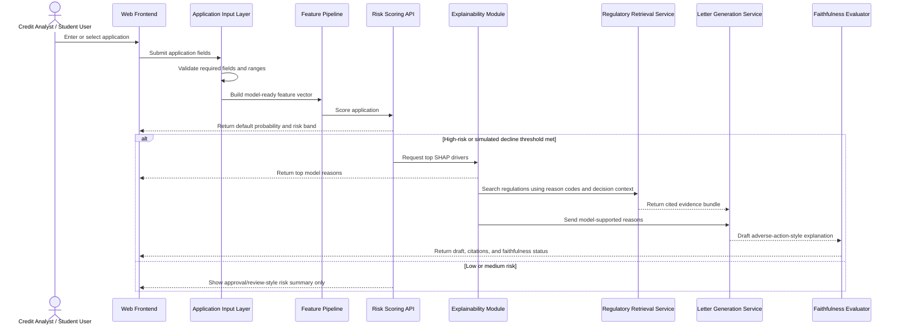
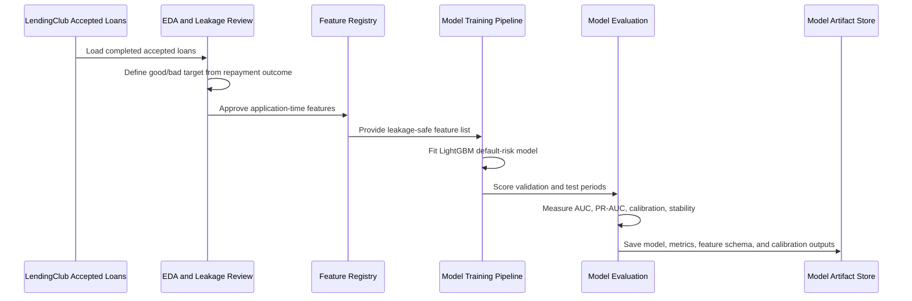
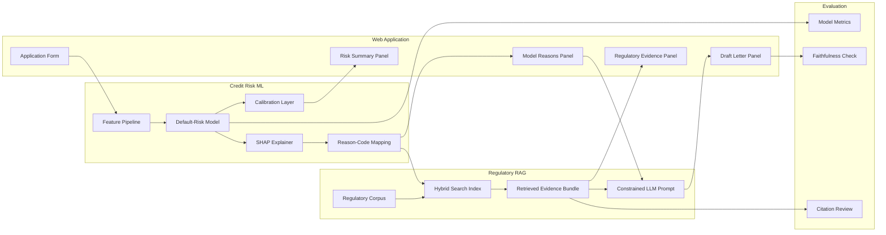

# CreditRiskRAG

CreditRiskRAG is a machine learning project for credit-risk analysis and adverse-action-style explanation generation. The project uses LendingClub accepted and rejected application data to build a leakage-aware default-risk workflow, then plans to combine model explanations with retrieval-augmented generation over consumer-credit regulatory sources.

The current implementation is focused on reproducible exploratory data analysis, data governance, leakage review, and modeling readiness. LightGBM, DistilBERT, SHAP, regulatory retrieval, and letter generation are part of the planned modeling and RAG phases documented in the proposal and branch plan.

## Project Objective

The project asks whether a credit-risk system can produce explanations that are more grounded, auditable, and policy-aligned than plain LLM-generated text.

The statistically defensible project framing is:

```text
Accepted loans with observed repayment outcomes
-> default-risk model
-> simulated high-risk lending decision
-> SHAP reason extraction
-> regulatory retrieval
-> adverse-action-style explanation draft
```

The model is not trained to predict historical denial. Rejected applications do not have observed repayment outcomes, so they are not valid default labels. Denial appears only as a simulated decision artifact created from the model's risk score and a transparent demo policy threshold.

Planned end-to-end workflow:

1. Predict default risk for completed accepted loans.
2. Use interpretable model outputs, such as SHAP, to identify major risk drivers.
3. Apply a demo lending policy that flags high-risk applications for a simulated decline or review decision.
4. Retrieve relevant policy and regulatory context from ECOA, Regulation B, FCRA, and CFPB guidance.
5. Generate adverse-action-style explanation drafts grounded in model evidence and retrieved sources.
6. Evaluate both predictive performance and explanation faithfulness.

## System Workflow and Web Application Design

The planned interface should behave like a compact credit-risk workbench: a user enters or selects an application, runs risk scoring, inspects the model drivers, retrieves regulatory support, and reviews a generated explanation. The look and feel should follow the form-driven web-application style of `lindaperez/DB_QueryMinds`: simple navigation, structured forms, clean result panels, and a CSS-first dashboard layout rather than a notebook-only experience.

### Actors

| Actor | Definition | Main Responsibilities |
| --- | --- | --- |
| Applicant / Demo Borrower | Person represented by an application record. In this research project, this is usually a held-out LendingClub record or synthetic demo input. | Provides application attributes such as loan amount, income, FICO range, DTI, employment length, and purpose. |
| Credit Analyst / Student User | Primary user of the web app. | Scores an application, reviews risk outputs, checks explanations, and compares retrieved regulatory evidence. |
| Risk Model Service | Backend component that owns feature validation and model inference. | Produces default probability, risk band, and model diagnostics. |
| Explanation Service | Backend component that converts model behavior into human-readable reasons. | Uses SHAP values and reason-code mappings to identify the top drivers of risk. |
| Regulatory Retrieval Service | Backend component that searches the curated regulatory corpus. | Retrieves relevant chunks from Regulation B, CFPB guidance, FCRA Section 615, and enforcement actions. |
| Letter Generation Service | LLM-backed component that drafts the explanation. | Produces adverse-action-style text grounded in SHAP reasons and retrieved regulatory sources. |
| Evaluator / Reviewer | Student, instructor, or compliance reviewer. | Reviews model metrics, citation quality, and whether the letter is faithful to the evidence. |

### Artifacts

| Artifact | Definition | Owner / Producer |
| --- | --- | --- |
| Accepted Loan Dataset | LendingClub issued loans with observed repayment outcomes. | Data pipeline / EDA workflow |
| Rejected Application Dataset | LendingClub rejected applications without repayment outcomes. | Data pipeline / EDA workflow |
| Feature Registry | List of approved application-time features, leakage status, transformations, and display names. | Data science workflow |
| Trained Risk Model | LightGBM or comparable classifier trained to predict bad repayment outcome. | Modeling workflow |
| Calibration Report | Evidence that predicted probabilities are usable as risk estimates. | Modeling workflow |
| SHAP Explanation | Per-application feature contribution output. | Explanation service |
| Reason-Code Mapping | Mapping from technical features to human-readable explanation reasons. | Data science / compliance review |
| Regulatory Corpus | Sectioned and indexed public documents from ECOA / Regulation B, CFPB guidance, FCRA, and Federal Register actions. | Retrieval pipeline |
| Retrieved Evidence Bundle | Top regulatory chunks returned for a specific application decision. | Retrieval service |
| Adverse-Action-Style Draft | Research artifact explaining a simulated high-risk or decline decision. | Letter generation service |
| Faithfulness Evaluation | Check that the draft cites model-supported reasons and retrieved sources. | Evaluation workflow |

### Components

| Component | Purpose | Suggested Implementation |
| --- | --- | --- |
| Web Frontend | Hosts the application form, risk summary, reason display, regulatory evidence, and generated draft. | Django templates or a lightweight Streamlit prototype; use the `DB_QueryMinds` form-and-panel style as the visual reference. |
| Application Input Layer | Validates user-entered or selected application fields. | Typed form schema with clear required fields and ranges. |
| Feature Pipeline | Converts raw application input into model-ready features. | Reusable Python preprocessing module shared by training and inference. |
| Risk Scoring API | Runs the trained model and returns probability, risk band, and threshold decision. | FastAPI, Django view, or internal Python service. |
| Explainability Module | Computes top SHAP drivers and maps them to readable reasons. | SHAP plus a curated reason-code mapping table. |
| Regulatory Index | Stores chunked public regulatory documents for search. | BM25 plus vector index for hybrid retrieval. |
| RAG Orchestrator | Combines SHAP reasons, retrieved evidence, and generation instructions. | Small LangGraph pipeline or plain service function if graph orchestration is unnecessary. |
| Letter Generator | Creates the final explanation draft. | LLM prompt constrained to model reasons and retrieved evidence. |
| Evaluation Dashboard | Shows model performance, calibration, retrieved citations, and faithfulness checks. | Web dashboard panel with saved evaluation outputs. |

### Sequence Diagram: Risk Scoring and Explanation



### Sequence Diagram: Model Training and Evaluation



### Component Graph



### Interface Screens

| Screen | Purpose | Key Elements |
| --- | --- | --- |
| Application Intake | Enter a new demo application or load a held-out LendingClub record. | Loan amount, income, DTI, FICO range, employment length, purpose, state, optional description, submit button. |
| Risk Result | Show the model result without hiding uncertainty. | Default probability, risk band, threshold used, calibration note, top model diagnostics. |
| Explanation Review | Show why the model produced the score. | Top SHAP drivers, mapped reason codes, feature values, plain-language reason labels. |
| Regulatory Evidence | Show why the explanation language is grounded. | Retrieved document title, citation, section, short excerpt, relevance score. |
| Draft Letter | Present the adverse-action-style draft as a research artifact. | Applicant-facing explanation, cited evidence, model-supported reasons, faithfulness pass/fail. |
| Evaluation Dashboard | Support instructor and team review. | AUC, PR-AUC, calibration curve, class balance, temporal split metrics, letter rubric scores. |

### Interface Design Notes

- Use a clean, form-first web app similar to `DB_QueryMinds`, with a top navigation bar and focused pages for input, results, evidence, and evaluation.
- Keep the first screen functional: the user should immediately see an application form or sample-record selector, not a marketing landing page.
- Use quiet dashboard styling: readable tables, compact cards for individual outputs, and clear section headers.
- Keep model and compliance boundaries visible: label generated text as an adverse-action-style research draft, not a legally approved notice.
- Make the retrieved evidence inspectable so users can verify which regulatory text influenced the generated draft.

## Current Progress

| Area | Status | Evidence |
| --- | --- | --- |
| Raw data setup | Complete | `data_manifest.json` records expected LendingClub file paths, headers, and SHA256 checksums. |
| Environment reproducibility | Complete | `environment.yml`, `requirements.lock.txt`, and `scripts/reproducibility_check.py`. |
| Accepted-loan EDA notebook | Complete / active | `EDA/Accepted_Loan_EDA.ipynb` contains accepted-loan EDA, cleaning, missingness, temporal analysis, target analysis, leakage audit, and modeling readiness. |
| Accepted-loan EDA artifacts | Complete / reproducible | EDA plots and tables are exported under `EDA/accepted_eda_outputs/` with stable filenames and reproducibility footers. |
| Decision logging | Complete / active | `Docs/EDA_DECISION_LOG.md` records target, leakage, cleaning, validation, and compliance decisions. |
| Project reproducibility docs | Complete | `Docs/REPRODUCIBILITY.md` defines environment, data, notebook, and plot reproducibility rules. |
| Team workflow | Drafted | `Docs/BRANCHING_PLAN.md` proposes branch ownership by project phase. |
| Predictive modeling | Planned | LightGBM baseline and validation workflow are not yet implemented in code. |
| NLP and RAG | Planned | DistilBERT, retrieval, LangGraph, and letter generation are documented as next phases. |

## Repository Structure

```text
CreditRiskRAG/
├── README.md
├── data_manifest.json
├── environment.yml
├── requirements.lock.txt
├── scripts/
│   └── reproducibility_check.py
├── Docs/
│   ├── BRANCHING_PLAN.md
│   ├── EDA_DECISION_LOG.md
│   ├── REPRODUCIBILITY.md
│   └── Prompts/
│       └── PromptEDA.md
└── EDA/
    ├── Accepted_Loan_EDA.ipynb
    ├── ACCEPTED_LOAN_EDA_DECISION_LOG.md
    └── accepted_eda_outputs/
        ├── plots/
        └── tables/
```

Raw LendingClub data is expected outside this project folder:

```text
Final/Data/archive/
├── accepted_2007_to_2018Q4.csv.gz
└── rejected_2007_to_2018Q4.csv.gz
```

## Data

The project uses Kaggle LendingClub accepted and rejected loan files from 2007 through 2018 Q4.

- Accepted loans contain originated loans, repayment outcomes, borrower attributes, loan terms, and many post-origination servicing fields.
- Rejected applications contain only application-decision attributes and do not include repayment outcomes.
- Supervised default modeling should use accepted loans only, because rejected applications do not have observed default labels.

The accepted and rejected datasets are analyzed together only for population comparison on defensibly harmonized fields. They are not treated as one supervised modeling population.

## Reproducibility First

Before running EDA or modeling, follow [Docs/REPRODUCIBILITY.md](Docs/REPRODUCIBILITY.md).

The project enforces reproducibility through:

- pinned Python and package versions;
- raw-data existence, checksum, and header checks;
- deterministic notebook settings;
- fixed sampling, chunking, and plot-export parameters;
- explicit leakage and feature-readiness documentation.

Minimum preflight:

```bash
cd Final/CreditRiskRAG
python scripts/reproducibility_check.py
```

For a faster development check that skips package and hash validation:

```bash
python scripts/reproducibility_check.py --skip-package-check --skip-hash-check
```

## Environment Setup

Use Python 3.11.

### Conda

```bash
cd Final/CreditRiskRAG
conda env create -f environment.yml
conda activate credit-risk-rag
python -m ipykernel install --user --name credit-risk-rag --display-name "Python (credit-risk-rag)"
```

### venv

```bash
cd Final/CreditRiskRAG
python3.11 -m venv .venv
source .venv/bin/activate
python -m pip install --upgrade pip
python -m pip install -r requirements.lock.txt
python -m ipykernel install --user --name credit-risk-rag --display-name "Python (credit-risk-rag)"
```

Create a local `.env` file:

```bash
cp .env.example .env
```

Then set `PROJECT_ROOT` to the absolute path of `Final/CreditRiskRAG`.

## Running The EDA

Run the reproducibility preflight first:

```bash
python scripts/reproducibility_check.py
```

Execute the notebook from a clean kernel:

```bash
jupyter nbconvert --to notebook --execute EDA/Accepted_Loan_EDA.ipynb --output Accepted_Loan_EDA.executed.ipynb
```

The EDA notebook is organized as:

- Executive summary
- Dataset overview
- Memory-safe loading strategy
- Cleaning and type conversion
- Target definition
- Missingness analysis
- Univariate EDA
- Temporal EDA
- Loan outcome EDA
- Accepted vs rejected analysis
- Leakage audit
- Modeling readiness
- Final recommendations
- Technical appendix

Generated accepted-loan EDA artifacts are written to:

```text
EDA/accepted_eda_outputs/
```

## Key EDA Decisions

The project currently follows these major modeling controls:

- Accepted loans and rejected applications are related but analytically separate datasets.
- Default modeling uses accepted loans only.
- Terminal statuses are used for completed-loan target construction.
- Current or unresolved loans are not treated as good outcomes.
- Raw fields are preserved and cleaned helper fields are added for analysis.
- Clear post-origination fields are excluded from modeling.
- Ambiguous fields are flagged for business, timestamp, or compliance review before use.
- Time-based validation is recommended as the primary validation strategy.
- Geography and text fields require additional fair-lending and privacy review.

See [Docs/EDA_DECISION_LOG.md](Docs/EDA_DECISION_LOG.md) for the full decision record.

## Planned Modeling Roadmap

The next engineering phases are:

1. Freeze the application-time feature registry with leakage labels.
2. Build a LightGBM default-risk baseline on completed accepted loans.
3. Use time-based train, validation, and test splits.
4. Evaluate discrimination, calibration, stability, and class-balance behavior.
5. Add SHAP explanations only after leakage-safe features are finalized.
6. Evaluate optional DistilBERT text features after privacy and proxy-risk review.
7. Build the regulatory retrieval corpus and chunking pipeline.
8. Generate adverse-action-style explanation drafts with retrieved regulatory context.
9. Evaluate generated explanations for grounding, faithfulness, clarity, and compliance risk.

## Documentation

- [Docs/REPRODUCIBILITY.md](Docs/REPRODUCIBILITY.md): environment, data, notebook, and plot reproducibility rules.
- [Docs/EDA_DECISION_LOG.md](Docs/EDA_DECISION_LOG.md): target, cleaning, leakage, feature, and validation decisions.
- [Docs/BRANCHING_PLAN.md](Docs/BRANCHING_PLAN.md): proposed team branch workflow.
- [Docs/Prompts/PromptEDA.md](Docs/Prompts/PromptEDA.md): prompt documentation used for EDA work.

## Compliance Note

This project is a research prototype. It does not establish that a model is legally valid for lending decisions. Any production lending use would require formal model validation, fair-lending review, adverse-action reason-code governance, compliance approval, and business sign-off.
