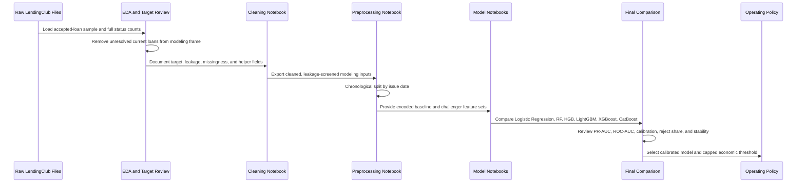
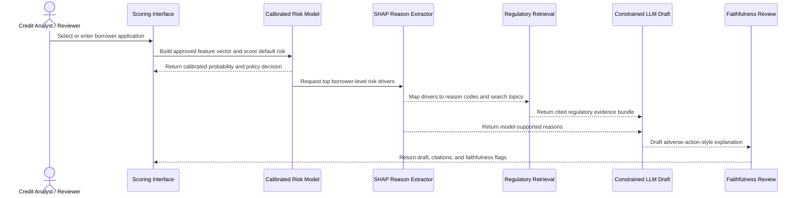
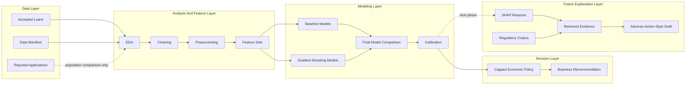

<div align="center">

# CreditRisk Interpretation RAG System

### A leakage-aware credit-risk modeling and policy analysis project for LendingClub loan outcomes

*Predict default risk from accepted-loan records, compare model families, calibrate probabilities, and translate scores into an auditable underwriting operating policy, with a future regulatory RAG explanation layer.*

**[Linda Perez Penaranda](https://github.com/lindaperez)<sup>1</sup> · Yashaswi Aryan<sup>1</sup> · Siddharth Agarwal<sup>1</sup>**

<sup>1</sup> Northeastern University - CS 6140 Machine Learning - Final Project · Summer 2026

Linda Perez Penaranda: collaborator, credit-risk framing, EDA, cleaning, modeling, policy analysis, reproducibility · Yashaswi Aryan: collaborator, model/retrieval workflow and project development · Siddharth Agarwal: collaborator, model/retrieval workflow and project development


[Overview](#overview) · [Architecture](#architecture) · [Current Progress](#current-progress) · [Artifacts](#artifact-inventory-by-folder) · [Data](#data) · [Reproducibility](#reproducibility) · [Environment](#environment) · [Decisions](#eda-key-decisions) · [Documentation](#documentation) · [References](#references)

</div>

## Overview

CreditRiskRAG is a credit-risk machine learning project using LendingClub accepted-loan data to build a leakage-aware default-risk model, evaluate business operating policies, and prepare for a future regulatory RAG explanation layer.

The current project is strongest on the tabular credit-risk pipeline: EDA, cleaning, preprocessing, model comparison, calibration, and policy analysis. The RAG layer is intentionally framed as the next phase, because explanation generation should depend on a stable, leakage-controlled model and approved reason-code mapping.


## Project Objective

The project tests whether a credit-risk workflow can produce model decisions and future adverse-action-style explanations that are grounded, auditable, and policy-aware.

The original proposal framed the research question as a comparison between retrieval-grounded letters and plain LLM letters: does retrieving actual policy text produce explanations that are more faithful to model reasoning and closer to regulatory requirements than a language model with no retrieval? The current repository has completed the credit-risk modeling foundation required for that experiment; the full RAG letter-generation system remains planned.

Current modeling scope:

```text
Accepted loans with observed repayment outcomes
-> default-risk model
-> calibrated probability
-> economic underwriting policy
-> business recommendation
```

Future RAG scope:

```text
Default-risk model
-> SHAP reason extraction
-> regulatory retrieval
-> adverse-action-style explanation draft
```

Rejected LendingClub applications are not used as supervised default labels because they do not have observed repayment outcomes.

## Proposal Alignment And Scope

| Proposal Item | Current README / Repo Status | Notes |
| --- | --- | --- |
| Predict default risk for completed accepted loans | Implemented | The project moved from proposal framing to a full accepted-loan modeling workflow with chronological splits and final model comparison. |
| Compare RAG-grounded letters against plain LLM letters | Planned | The README now states this as the future explanation experiment rather than a completed result. |
| Use SHAP to connect predictions to borrower-level reasons | Planned | Selected XGBoost models are SHAP-compatible, but SHAP reason extraction is not yet implemented. |
| Build a regulatory corpus from ECOA / Regulation B, CFPB guidance, FCRA Section 615, and Federal Register enforcement actions | Planned | The proposal identifies the corpus sources; the repository does not yet include the retrieved/chunked corpus. |
| Use LangGraph for retrieval and letter-generation orchestration | Planned | Kept as an architecture option for the future RAG layer. |
| Use DistilBERT on borrower free text | Deferred | The current production-style model intentionally avoids text fields because of privacy, proxy-risk, and explanation concerns. |
| Use a smaller DistilBERT checker for explanation faithfulness | Planned / deferred | The README now treats faithfulness checking as part of future evaluation, not current implementation. |
| Grade generated letters with a short rubric and hand-scored examples | Planned | This is included in the future roadmap and evaluation gap. |
| Address class imbalance, temporal drift, and compliance measurement limits | Covered | The current workflow uses PR-AUC, calibration, chronological validation, business policy caps, and a compliance note. |

## Architecture

### Sequence Diagram: Model Training And Evaluation



### Sequence Diagram: Future RAG Explanation Flow



### Component Graph



## Current Progress

| Area | Status | Primary Artifact | Engineering Note |
| --- | --- | --- | --- |
| Business framing | Complete | `Docs/Business/` | Defines accepted-loan target, underwriting workflow, and modeling business interpretation. |
| Problem research | Complete / reference | `Docs/Problem_Research/` | Summarizes LendingClub, explainability, LLM, and monitoring literature. |
| EDA | Complete / active | `EDA/Accepted_Loan_EDA.ipynb` | Uses accepted loans for repayment-risk analysis and logs target/leakage choices. |
| Cleaning | Complete / active | `Cleaning/Accepted_Loan_Cleaning.ipynb` | Preserves raw fields and creates auditable helper fields. |
| Preprocessing | Complete / active | `Modeling/Preprocessing/0_Preprocessing.ipynb` | Builds chronological splits and feature-set exports. |
| Baseline models | Complete | `Modeling/1_LogisticRegression_Modeling.ipynb` through `Modeling/3_HistGradientBoosting_Modeling.ipynb` | Establishes benchmark and sklearn tree baselines. |
| Gradient boosting models | Complete | `Modeling/4_LightGBM_Modeling.ipynb` through `Modeling/6_CatBoost_Modeling.ipynb` | Tests stronger tabular candidates. |
| Advanced model scripts | Complete | `Modeling/7_Advanced_Script_Pipeline.ipynb` | Notebook wrapper for reproducible advanced scripts. |
| Missingness challenger tests | Complete | `Modeling/modeling_outputs/missingness_challenger*/` | Tests whether sparse public-record recency features add stable lift. |
| Grade/subgrade and interest-rate ablation | Complete | `Modeling/8_XGBoost_grade_IntRate_Ablation.ipynb` | Confirms overlap between LendingClub grade signals and interest rate. |
| Calibration analysis | Complete | `Modeling/modeling_outputs/final_comparison/tables/final_model_calibration_summary.csv` | Uses Platt calibration for probability interpretation. |
| Economic operating policy | Complete | `Modeling/modeling_outputs/final_comparison/tables/final_model_economic_underwriting_recommendation.csv` | Uses capped reject/review policy instead of unconstrained best-F1. |
| Final model comparison | Complete / active | `Modeling/9_Final_Model_Comparison.ipynb` | Consolidates final metrics, calibration, ablation, and policy recommendation. |
| SHAP, RAG, and explanation generation | Next phase | Planned regulatory explanation layer | Should start after reason-code mapping and governance review. |

**Collaborator handoff:** The accepted-loan credit-risk pipeline is complete through EDA, cleaning, preprocessing, model training, final model comparison, calibration, grade/subgrade and interest-rate ablation, and capped economic policy analysis. The current recommendation is a project-ready neutral XGBoost risk-ranking model for accepted loans, using `int_rate_clean` while excluding `grade` and `sub_grade`. What remains is the explanation layer: SHAP reason extraction, human-readable reason-code mapping, regulatory corpus retrieval, RAG-grounded adverse-action-style draft generation, and faithfulness/compliance evaluation.

## Business Credit-Risk Summary

The business summary in `Docs/Business/3.-MODELING_BUSINESS_SUMMARY_FOR_DATA_SCIENCE_COLLABORATORS.md` is the main credit-risk interpretation layer for collaborators. The README carries the high-level takeaways, while the document keeps the detailed modeling narrative.

| Business Question | README-Level Answer |
| --- | --- |
| What did the project optimize for? | Default-risk ranking, calibrated probability interpretation, reject/review volume, approved bad rate, rejected bad rate, and economic value. |
| Why not choose the best-F1 threshold? | Best-F1 thresholds over-rejected applicants, with some models rejecting roughly 45% to 50% of validation cases. |
| What operating policy is preferred? | Calibrated risk score -> economic value threshold -> maximum reject/review cap around 20%. |
| What model family is preferred? | Neutral XGBoost because it gives strong tabular performance, SHAP compatibility, and stable governance tradeoffs. |
| Why use neutral XGBoost class weighting? | Weighted XGBoost had nearly identical ranking performance but inflated raw predicted probabilities. |
| Why use Platt calibration? | It materially improved probability interpretation before threshold-based decisions. |
| Why remove `grade` and `sub_grade`? | They overlap strongly with `int_rate_clean`; removing explicit grade buckets preserves nearly identical performance and improves governance/parsimony. |
| What is the core business limitation? | The model estimates repayment risk conditional on LendingClub approval, not risk for all loan applicants. |

Key business numbers from the current modeling summary:

| Evidence | Value / Interpretation |
| --- | --- |
| Weighted XGBoost validation PR-AUC | `0.425707` |
| Neutral XGBoost validation PR-AUC | `0.425691`; nearly unchanged ranking |
| Weighted XGBoost mean raw validation probability | `0.463151`; inflated relative to actual bad rate |
| Neutral XGBoost mean raw validation probability | `0.197892`; less distorted before calibration |
| Platt validation expected calibration error | `0.008255` for the older weighted XGBoost calibration example |
| Preferred model test PR-AUC | `0.380806` for `xgb_neutral_09_without_grade_subgrade_with_int_rate` |
| Preferred model top-20% rejected bad rate | `40.09%` |
| Preferred model top-20% default capture | `38.13%` |
| Preferred capped economic-policy estimated value | `$123,907,500` |
| Economic policy example assumptions | True positive catches estimated loss: `+$10,000`; false positive rejects good borrower: `-$1,500` |

## Repository Structure

```text
CreditRiskRAG/
├── Cleaning/
│   ├── Accepted_Loan_Cleaning.ipynb
│   ├── FEATURE_CLEANING_DECISIONS.md
│   └── cleaning_outputs/
├── Docs/
│   ├── Business/
│   ├── Problem_Research/
│   ├── Prompts/
│   └── REPRODUCIBILITY.md
├── EDA/
│   ├── Accepted_Loan_EDA.ipynb
│   ├── ACCEPTED_LOAN_EDA_DECISION_LOG.md
│   └── accepted_eda_outputs/
├── Modeling/
│   ├── 00.-MODEL_PREPROCESSING_OPTIONS.md
│   ├── Preprocessing/
│   ├── 1_LogisticRegression_Modeling.ipynb
│   ├── 2_RandomForest_Modeling.ipynb
│   ├── 3_HistGradientBoosting_Modeling.ipynb
│   ├── 4_LightGBM_Modeling.ipynb
│   ├── 5_XGBoost_Modeling.ipynb
│   ├── 6_CatBoost_Modeling.ipynb
│   ├── 7_Advanced_Script_Pipeline.ipynb
│   ├── 8_XGBoost_grade_IntRate_Ablation.ipynb
│   ├── 9_Final_Model_Comparison.ipynb
│   └── modeling_outputs/
├── scripts/
├── LCDataDictionary.xlsx
├── data_manifest.json
├── environment.yml
├── requirements.lock.txt
└── README.md
```

## Artifact Inventory By Folder

The README is intentionally not a full file listing, but these are the main folders and artifacts reviewers should know about.

| Folder | What It Contains | Key Artifacts |
| --- | --- | --- |
| `EDA/` | Accepted-loan exploratory analysis, target review, leakage audit, missingness review, and model-readiness outputs. | `Accepted_Loan_EDA.ipynb`, `ACCEPTED_LOAN_EDA_DECISION_LOG.md`, `accepted_eda_outputs/tables/accepted_safe_starter_features.csv`, `accepted_eda_outputs/tables/accepted_leakage_audit_all_raw_columns.csv`, `accepted_eda_outputs/plots/` |
| `Cleaning/` | Cleaned modeling frame creation, target extraction, traceability exports, and cleaning QA tables. | `Accepted_Loan_Cleaning.ipynb`, `FEATURE_CLEANING_DECISIONS.md`, `cleaning_outputs/datasets/accepted_cleaned_completed_frame.parquet`, `accepted_X_starter.parquet`, `accepted_y_target_bad.parquet`, `accepted_traceability.parquet` |
| `Modeling/Preprocessing/` | Chronological train/validation/test split, feature-set exports, encoding manifests, and preprocessing QA. | `0_Preprocessing.ipynb`, `preprocessing_outputs/datasets/*_train_X.parquet`, `*_validation_X.parquet`, `*_test_X.parquet`, `preprocessing_outputs/tables/preprocessing_feature_set_summary.csv`, `preprocessing_split_summary.csv` |
| `Modeling/modeling_outputs/` | Model artifacts, candidate rankings, selected metrics, review-volume precision, calibration analysis, and final comparison tables/plots. | `final_comparison/tables/final_model_recommendation.csv`, `final_model_selected_metrics.csv`, `final_model_calibration_summary.csv`, `final_model_economic_underwriting_recommendation.csv`, `final_comparison/plots/` |
| `Modeling/modeling_outputs/*/models/` | Saved selected model artifacts for baseline, tuned, challenger, and ablation runs. | `*.joblib` selected models for Logistic Regression, Random Forest, HistGradientBoosting, LightGBM, XGBoost, CatBoost, neutral XGBoost, and PR-AUC optimized runs |
| `Docs/Business/` | Business framing and collaborator-facing interpretation. | Loan-status interpretation, consumer-credit underwriting workflow, and modeling business summary |
| `Docs/Problem_Research/` | Literature review and project references. | `Papers.md`, `Paper_Reading_Summary.md` |
| `scripts/` | Reproducibility checks and advanced modeling/policy scripts used by the notebook pipeline. | `reproducibility_check.py`, `run_missingness_challenger_all_models.py`, `run_pr_auc_optimized_advanced_models.py`, `test_xgboost_grade_int_rate_combinations.py`, `create_economic_underwriting_policy.py` |
| `../Others/ProjectProposalDrafts/` | Original and revised project proposal drafts, PDF evaluation, LaTeX source, and final one-page proposal PDF. | `FinalProposal/Project_Proposal_2_Revised.pdf`, `Project_Proposal_2_Revised.tex`, `Project_Proposal_2_PDF_Evaluation.md` |
| `../Others/Repo/` | GitHub collaboration and repository safety notes. | `GIT_COLLABORATOR_WORKFLOW.md`, `GITHUB_SAFETY_CONFIGURATION.md` |
| `../Others/video/` | Underwriting workflow explainer video materials. | `underwriting_workflow_explainer/storyboard.md`, `consumer_credit_underwriting_explainer.mp4` |
| `../Others/POSSIBLE_RISKS.md` | Supplemental risk log from dataset and project review. | Dataset freshness, source/TOS uncertainty, leakage, censoring, selection bias, and fair-lending/proxy-risk notes |

## Data

The project uses Kaggle LendingClub accepted and rejected loan files from 2007 through 2018 Q4. Raw files are expected outside this project folder:

```text
Final/Data/archive/
├── accepted_2007_to_2018Q4.csv.gz
└── rejected_2007_to_2018Q4.csv.gz
```

| File | Role | Modeling Use |
| --- | --- | --- |
| `accepted_2007_to_2018Q4.csv.gz` | Originated loans with repayment outcomes and loan/account attributes. | Used for supervised default modeling after target and leakage review. |
| `rejected_2007_to_2018Q4.csv.gz` | Rejected applications without repayment outcomes. | Not used as supervised default labels; useful only for population comparison or demo context. |
| `data_manifest.json` | Expected file paths, SHA256 checksums, and headers. | Source of truth for data preflight checks. |
| `LCDataDictionary.xlsx` | LendingClub field definitions. | Reference for feature meaning and timing review. |

### Dataset Scope Reconciliation

The one-page proposal described an earlier LendingClub project scope of about 890,000 loans and roughly 75 fields. The current repository uses the larger accepted-loan file available in this workspace and documents its actual schema through EDA and `data_manifest.json`.

| Source | Scope Stated / Used | README Interpretation |
| --- | --- | --- |
| Revised project proposal | About 890,000 LendingClub loans and roughly 75 features. | Historical proposal framing; useful for intent but not the current source-of-truth counts. |
| Current accepted-loan EDA | 2,260,701 raw accepted-loan rows and 151 columns; 250,000-row reproducible EDA sample. | Current implementation scope for accepted-loan modeling and full loan-status scans. |
| Current modeling target | Completed accepted loans after target/censoring filters. | Supervised model estimates default risk for originated loans with observed repayment outcomes. |
| Rejected applications | Rejected applicant records without repayment outcomes. | Not used as supervised default labels. |

## Reproducibility

Reproducibility is treated as a project requirement, not an afterthought.

| Control | Rule |
| --- | --- |
| Raw data | Keep raw LendingClub files unchanged under `Final/Data/archive/`. |
| Manifest | Validate file paths, headers, and SHA256 hashes from `data_manifest.json`. |
| Environment | Use Python 3.11 and install from `requirements.lock.txt` or `environment.yml`. |
| Randomness | Use fixed seeds for sampling, splits, and stochastic model steps. |
| Sampling | EDA uses a reproducible 250,000-row accepted-loan sample for exploration. |
| Validation | Use chronological issue-date splits as the primary estimate. |
| Leakage control | Use reviewed feature lists; do not infer final model columns automatically. |
| Auditability | Keep raw and cleaned helper fields side by side where possible. |

Run the strict preflight:

```bash
python scripts/reproducibility_check.py
```

Run a faster development check:

```bash
python scripts/reproducibility_check.py --skip-package-check --skip-hash-check
```

## Environment

Use Python 3.11.

### venv

```bash
cd Final/CreditRiskRAG
python3.11 -m venv .venv
source .venv/bin/activate
python -m pip install --upgrade pip
python -m pip install -r requirements.lock.txt
python -m ipykernel install --user --name credit-risk-rag --display-name "Python (credit-risk-rag)"
```

### Conda

```bash
cd Final/CreditRiskRAG
conda env create -f environment.yml
conda activate credit-risk-rag
python -m ipykernel install --user --name credit-risk-rag --display-name "Python (credit-risk-rag)"
```

Primary packages:

| Package | Version / Role |
| --- | --- |
| Python | `3.11` |
| pandas | `2.2.2` |
| scikit-learn | `1.5.2` |
| XGBoost | Gradient boosting model |
| LightGBM | Gradient boosting challenger |
| CatBoost | Categorical boosting challenger |
| Jupyter / ipykernel | Notebook execution |

## EDA Key Decisions

| Area | Decision | Rationale |
| --- | --- | --- |
| Population | Use accepted/originated LendingClub loans for supervised modeling. | Repayment outcomes are observable only for originated loans. |
| Working sample | Use a reproducible 250,000-row EDA sample and full-file loan-status scans. | Keeps exploration efficient while preserving full-target distribution evidence. |
| Current loans | Remove `loan_status == "Current"` from modeling-oriented EDA. | Current loans are active/censored and do not have final repayment outcomes. |
| Target | Create `target_bad` from completed outcomes only. | Avoids treating unresolved loans as good outcomes. |
| Leakage | Exclude post-origination servicing, payment, recovery, hardship, settlement, last-FICO, and last-credit-pull fields. | These fields are unavailable at application time and inflate performance. |
| Missingness | Treat structural missingness separately from random missingness. | Joint-applicant and delinquency-recency fields can be missing for business reasons. |
| Validation | Use chronological issue-date splits. | Borrower mix, pricing policy, and macro conditions change over time. |
| Starter features | Begin with leakage-screened application-time and credit-bureau style features. | Creates a defensible baseline before adding sparse or policy-sensitive fields. |

## Cleaning Key Decisions

| Area | Decision | Rationale |
| --- | --- | --- |
| Raw fields | Preserve raw source columns and add helper fields. | Keeps lineage from LendingClub values to model-ready values. |
| Percent fields | Parse `int_rate` and `revol_util` into numeric helper columns. | Supports numeric modeling while preserving raw strings. |
| Terms and employment | Convert `term` to `term_months` and `emp_length` to `emp_length_years`. | Produces stable model-ready numeric features. |
| FICO ranges | Use `fico_mean` from low/high FICO endpoints. | Reduces duplicated range fields into one interpretable signal. |
| Dates | Parse `issue_d` and `earliest_cr_line`; derive credit-history age. | Avoids raw date leakage and creates a borrower-tenure feature. |
| Identifiers | Exclude `id`, `member_id`, and `url` from model features. | Prevents memorization and lookup leakage. |
| Text fields | Exclude `emp_title`, `desc`, and `title` from the baseline. | Text carries privacy, proxy, cardinality, and explanation risks. |
| Geography | Treat `zip_code` and `addr_state` as proxy-risk fields requiring separate review. | Geography can create fair-lending and reason-code concerns. |

## Preprocessing Key Decisions

| Area | Decision | Rationale |
| --- | --- | --- |
| Split order | Split chronologically before fitting imputers or encoders. | Prevents future-period leakage through preprocessing. |
| Baseline features | Exclude `mths_since_last_record` from the baseline. | It is about 83% missing and belongs in a challenger test. |
| Missing indicators | Add indicators for `mths_since_last_delinq` and optionally `emp_length_years`. | Missingness can carry credit-file information. |
| Numeric imputation | Fit median imputers on train only. | More robust for skewed income, balance, and utilization variables. |
| Categorical imputation | Fill missing categories as `Missing`. | Keeps missingness explicit and auditable. |
| Encoding | One-hot encode low-cardinality categoricals for sklearn models. | Supports linear models and sklearn tree baselines. |
| Scaling | Apply scaling where required by model family. | Logistic regression needs it; tree models generally do not. |
| Evaluation | Report ROC-AUC, PR-AUC, calibration, fixed-volume precision, capped economic policy, and confusion matrices. | Accuracy alone is not enough for imbalanced credit risk. |

## Notebook Order

Run the notebooks in numeric order.

| Step | Notebook |
| ---: | --- |
| 0 | `Modeling/Preprocessing/0_Preprocessing.ipynb` |
| 1 | `Modeling/1_LogisticRegression_Modeling.ipynb` |
| 2 | `Modeling/2_RandomForest_Modeling.ipynb` |
| 3 | `Modeling/3_HistGradientBoosting_Modeling.ipynb` |
| 4 | `Modeling/4_LightGBM_Modeling.ipynb` |
| 5 | `Modeling/5_XGBoost_Modeling.ipynb` |
| 6 | `Modeling/6_CatBoost_Modeling.ipynb` |
| 7 | `Modeling/7_Advanced_Script_Pipeline.ipynb` |
| 8 | `Modeling/8_XGBoost_grade_IntRate_Ablation.ipynb` |
| 9 | `Modeling/9_Final_Model_Comparison.ipynb` |

Step 7 wraps advanced scripts in a notebook so collaborators can reproduce the workflow without manually running terminal commands. Step 9 runs `scripts/create_operating_policy_analysis.py` internally.

## Implementation Scripts

| Script | Purpose |
| --- | --- |
| `scripts/reproducibility_check.py` | Validates environment, raw data files, file hashes, headers, and notebook reproducibility markers. |
| `scripts/create_missingness_no_grade_subgrade_dataset.py` | Builds the missingness challenger feature set without `grade` and `sub_grade`. |
| `scripts/run_missingness_challenger_all_models.py` | Runs missingness challenger experiments across model families. |
| `scripts/run_missingness_no_grade_subgrade_all_models.py` | Runs missingness challenger experiments with grade/subgrade removed. |
| `scripts/run_pr_auc_optimized_advanced_models.py` | Runs PR-AUC optimized advanced model candidates. |
| `scripts/review_xgboost_class_weighting.py` | Compares weighted vs neutral XGBoost probability behavior. |
| `scripts/tune_neutral_xgboost_missingness_challenger.py` | Tunes neutral XGBoost on the missingness challenger feature set. |
| `scripts/tune_neutral_xgboost_no_grade_subgrade.py` | Tunes neutral XGBoost with `grade` and `sub_grade` removed. |
| `scripts/test_xgboost_grade_int_rate_combinations.py` | Runs grade/subgrade and interest-rate ablation experiments. |
| `scripts/create_calibration_analysis.py` | Produces calibration analysis outputs. |
| `scripts/create_economic_underwriting_policy.py` | Builds capped economic underwriting policy outputs. |
| `scripts/create_operating_policy_analysis.py` | Creates final operating policy analysis used by the final comparison notebook. |
| `scripts/generate_advanced_scripts_pipeline_notebook.py` | Generates the notebook wrapper for advanced script execution. |

## RAG And Explanation Roadmap From Proposal

The proposal's RAG layer is still useful, but it should be built on top of the completed credit-risk model rather than mixed into the baseline model prematurely.

| Component | Planned Role | Current Status |
| --- | --- | --- |
| Regulatory corpus | Collect and chunk about 50 public documents from ECOA / Regulation B, CFPB adverse-action guidance and model forms, FCRA Section 615, and Federal Register enforcement actions. | Planned; corpus files are not yet in the repository. |
| Retrieval | Search regulatory text relevant to the model's reason codes and decision context. | Planned. |
| SHAP reason extraction | Convert model behavior into top borrower-level drivers. | Planned for selected XGBoost model. |
| Reason-code mapping | Translate technical features into applicant-understandable explanation categories. | Planned; should be reviewed for compliance and fairness. |
| LangGraph orchestration | Coordinate retrieval, reason linking, drafting, and validation. | Planned architecture option. |
| Plain LLM baseline | Generate explanation without retrieval for comparison. | Planned evaluation baseline. |
| RAG-grounded draft | Generate explanation constrained by model reasons and retrieved policy text. | Planned. |
| Faithfulness checker | Reject or flag drafts that cite reasons not supported by SHAP or retrieved evidence. | Planned; proposal considered a DistilBERT-based checker. |
| Human rubric | Score clarity, faithfulness, citation support, hallucination risk, and compliance boundaries. | Planned with hand-scored examples. |

## Planned Modeling Roadmap

| Phase | Status | Next Engineering Action |
| --- | --- | --- |
| Leakage-screened baseline | Complete | Keep as the reference model family comparison. |
| Gradient boosting comparison | Complete | Preserve XGBoost, LightGBM, and CatBoost outputs for final reporting. |
| Missingness challengers | Complete | Summarize challenger lift and stability in the final report. |
| Grade/subgrade and interest-rate ablation | Complete | Use in governance discussion and feature-policy justification. |
| Probability calibration | Complete | Use calibrated probabilities for policy analysis, not raw scores. |
| Economic operating policy | Complete | Report capped threshold and reject/review share alongside model metrics. |
| SHAP reason extraction | Planned | Add borrower-level explanations for the selected leakage-clean model. |
| Reason-code mapping | Planned | Map technical features to applicant-understandable reason categories. |
| Regulatory retrieval | Planned | Build a small corpus from ECOA, Regulation B, FCRA, CFPB, and relevant guidance. |
| RAG explanation generation | Planned | Generate constrained adverse-action-style drafts grounded in model reasons and retrieved evidence. |
| Explanation evaluation | Planned | Evaluate citation support, faithfulness, hallucination risk, and compliance boundaries. |

## Modeling Key Decisions

| Decision | Choice | Reason |
| --- | --- | --- |
| Model selection objective | Optimize for risk ranking, calibration, and usable operating policy. | Highest F1 can produce unrealistic over-rejection. |
| Preferred model family | XGBoost. | Strong tabular performance and mature explainability support. |
| Class weighting | Use neutral `scale_pos_weight=1`. | Weighted XGBoost had nearly unchanged ranking but distorted raw probabilities. |
| Calibration | Use Platt calibration. | Improves probability interpretation while preserving ranking behavior. |
| Feature policy | Remove `grade` and `sub_grade`; keep `int_rate_clean`. | Keeps nearly identical predictive performance while avoiding explicit LendingClub grade buckets. |
| Operating threshold | Use capped economic policy with about 20% maximum reject/review share. | Prevents the best-F1 threshold from rejecting roughly 45% to 50% of applicants. |
| Evaluation metrics | Use PR-AUC, ROC-AUC, calibration, reject share, rejected bad rate, approved bad rate, and estimated economic value. | Captures class imbalance, probability quality, and business impact. |
| RAG boundary | Do not generate regulatory explanations until model reasons and feature policy are stable. | Prevents fluent explanations for unstable or leakage-prone model behavior. |

## Recommended Model

Preferred production-style model:

```text
xgb_neutral_09_without_grade_subgrade_with_int_rate
```

Recommended policy:

- Use neutral XGBoost with `scale_pos_weight=1`.
- Exclude `grade` and `sub_grade`.
- Keep `int_rate_clean`.
- Use Platt calibration before probability-based decisions.
- Use a capped economic underwriting policy instead of the automated best-F1 threshold.
- Apply a maximum reject/review cap around 20%.

## Grade/Subgrade And Interest-Rate Ablation

This section answers a business governance question: does the model need LendingClub's explicit `grade` and `sub_grade` fields, or can it perform just as well with borrower/application information plus the loan's interest rate?

| Experiment | Feature Policy | Validation PR-AUC | Test PR-AUC | Test Reject Share | Estimated Value |
| --- | --- | ---: | ---: | ---: | ---: |
| A | Keep `grade/sub_grade` and keep `int_rate_clean` | `0.426323` | `0.380704` | `20.13%` | `$121,918,500` |
| B | Remove `grade/sub_grade`, keep `int_rate_clean` | `0.426423` | `0.380806` | `20.49%` | `$123,907,500` |
| C | Keep `grade/sub_grade`, remove `int_rate_clean` | `0.426470` | `0.381304` | `19.92%` | `$120,834,000` |
| D | Remove `grade/sub_grade` and remove `int_rate_clean` | `0.422215` | `0.375358` | `20.49%` | `$121,606,000` |

### How To Read These Metrics

| Metric | Plain-English Meaning | Business Interpretation |
| --- | --- | --- |
| Validation PR-AUC | How well the model ranked likely bad loans above good loans on the tuning period, focusing on the default class. | Useful because defaults are the minority class. Higher PR-AUC means the review queue is more concentrated with risky loans. |
| Test PR-AUC | Same ranking metric on the held-out future period. | Shows whether the model generalizes beyond the period used for selection. |
| Test Reject Share | Share of accepted-loan records that would be flagged for decline/review under the capped policy. | Keeps the policy operationally realistic. A very high reject share can be unacceptable even if a metric improves. |
| Rejected Bad Rate / Top-20% Bad Rate | Among the loans the model flags as riskiest, the share that actually became bad. | Measures whether the model is useful for prioritizing manual review or risk mitigation. |
| Default Capture | Share of all bad loans captured inside the review/reject group. | Measures how much portfolio risk the policy catches at a fixed review capacity. |
| Estimated Value | Dollar value from the assumed policy framework. | Converts model ranking into a business decision tradeoff between avoided default loss and lost good-loan revenue. |

PR-AUC is more important than accuracy here because most accepted loans do not default. A model can look accurate by mostly predicting "good loan," but that would not help a lender find the smaller group of loans that create most credit losses. PR-AUC asks a harder and more relevant question: when the model assigns high risk, are those loans truly enriched for defaults?

### Business Insights And Conclusions

| Insight | Conclusion |
| --- | --- |
| `grade/sub_grade` and `int_rate_clean` carry overlapping risk information. | Keeping both does not materially improve model performance. |
| Removing only `grade/sub_grade` keeps performance effectively unchanged. | The preferred model can avoid explicit LendingClub grade buckets while still using `int_rate_clean`, which is available on funded accepted loans. |
| Removing both grade signals and interest rate creates the only meaningful decline. | LendingClub pricing/risk information is useful, but one pricing/risk signal is enough for this project. |
| The strict statistical winner is not the best business choice. | Experiment C has the highest validation PR-AUC by only `0.000047`, which is too small to justify a less defensible feature policy. |
| The preferred model has a test PR-AUC of `0.380806` and a top-20% rejected bad rate of `40.09%`. | The model can concentrate risk: the highest-risk 20% contains a much higher bad-loan rate than the overall accepted-loan population. |
| The capped economic policy avoids best-F1 over-rejection. | The model is useful as a controlled review/risk-ranking tool, not as an unconstrained automated rejection engine. |

The ablation study shows that `grade/sub_grade` and `int_rate_clean` provide highly overlapping LendingClub pricing/risk information. Including both did not improve performance. Removing both produced the only noticeable decline, but the model still performed reasonably well using borrower and loan application features alone.

The strict statistical winner was experiment C, but its validation PR-AUC advantage over the preferred model was only `0.000047`. The preferred model removes explicit LendingClub grade labels, keeps `int_rate_clean`, and is more defensible for governance and parsimony.

## Business Usefulness For Accepted Loans

The current model is useful for accepted/funded LendingClub loans with observed repayment outcomes. At this stage, it is best interpreted as a project-ready risk-ranking and policy-analysis model: the modeling workflow is complete enough to support the final project recommendation, while production lending use would require additional validation and governance.

| Stakeholder | How The Model Is Useful Today |
| --- | --- |
| Credit risk team | Prioritizes accepted loans by estimated default risk and identifies the riskiest segment for review. |
| Portfolio / finance team | Compares the expected value of different review caps and threshold policies. |
| Model governance reviewers | Shows how feature choices affect performance and defensibility, especially around `grade`, `sub_grade`, and `int_rate_clean`. |
| Data science collaborators | Provides a reproducible benchmark across Logistic Regression, Random Forest, HistGradientBoosting, LightGBM, XGBoost, and CatBoost. |
| Compliance / policy reviewers | Creates a controlled foundation for future reason-code and adverse-action-style explanation work, while clearly separating research from approved lending use. |
| Instructors / evaluators | Demonstrates leakage control, chronological validation, calibration, ablation testing, and business-metric interpretation. |

Under the preferred model and capped policy, the highest-risk 20% review group has an observed bad rate around `40.09%` on the test period and captures about `38.13%` of defaults. In business terms, the model gives stakeholders a defensible way to focus limited review capacity on the accepted loans where credit losses are most concentrated.

### Current Readiness

| Readiness Area | Status |
| --- | --- |
| Final project risk model | Ready for project reporting and business interpretation. |
| Reproducible modeling workflow | Ready: EDA, cleaning, preprocessing, model comparison, calibration, and policy analysis are documented. |
| Portfolio risk-ranking use case | Ready as a research/prototype decision-support workflow for accepted loans. |
| Production lending deployment | Not ready without independent validation, monitoring design, fair-lending review, reason-code governance, and compliance approval. |
| Rejected-applicant default prediction | Out of scope because rejected applications do not have observed repayment labels in this dataset. |
| RAG adverse-action-style generation | Next phase after SHAP reason extraction and reason-code mapping. |

## Documentation

| Document | Purpose |
| --- | --- |
| [Docs/Business/1.-ACCEPTED_LOAN_STATUS_BUSINESS_INTERPRETATION.md](Docs/Business/1.-ACCEPTED_LOAN_STATUS_BUSINESS_INTERPRETATION.md) | Business interpretation of LendingClub loan statuses and target meaning. |
| [Docs/Business/2.-CONSUMER_CREDIT_UNDERWRITING_WORKFLOW.md](Docs/Business/2.-CONSUMER_CREDIT_UNDERWRITING_WORKFLOW.md) | Underwriting workflow and credit-risk business context. |
| [Docs/Business/3.-MODELING_BUSINESS_SUMMARY_FOR_DATA_SCIENCE_COLLABORATORS.md](Docs/Business/3.-MODELING_BUSINESS_SUMMARY_FOR_DATA_SCIENCE_COLLABORATORS.md) | Modeling process, final recommendation, and business decision logic. |
| [EDA/ACCEPTED_LOAN_EDA_DECISION_LOG.md](EDA/ACCEPTED_LOAN_EDA_DECISION_LOG.md) | EDA target, leakage, missingness, validation, and starter-feature decisions. |
| [Cleaning/FEATURE_CLEANING_DECISIONS.md](Cleaning/FEATURE_CLEANING_DECISIONS.md) | Feature cleaning, exclusion, review, and baseline feature rules. |
| [Modeling/00.-MODEL_PREPROCESSING_OPTIONS.md](Modeling/00.-MODEL_PREPROCESSING_OPTIONS.md) | Preprocessing requirements, feature-set plan, and model options. |
| [Docs/REPRODUCIBILITY.md](Docs/REPRODUCIBILITY.md) | Environment, data, notebook, and plot reproducibility rules. |
| [Docs/Problem_Research/Papers.md](Docs/Problem_Research/Papers.md) | Literature review table and reading notes. |
| [Docs/Problem_Research/Paper_Reading_Summary.md](Docs/Problem_Research/Paper_Reading_Summary.md) | Supplemental paper reading summary. |
| [Docs/Prompts/Prompt.md](Docs/Prompts/Prompt.md) | Prompt and documentation record for project development. |

## README Coverage Check

| Area Audited | Covered In README | Remaining Gap |
| --- | --- | --- |
| `EDA/` | Yes | Individual EDA plot/table interpretation remains in the EDA notebook and decision log, not duplicated here. |
| `Cleaning/` | Yes | Detailed column-by-column cleaning rules remain in `FEATURE_CLEANING_DECISIONS.md`. |
| `Modeling/Preprocessing/` | Yes | Exact encoded feature columns remain in preprocessing manifests. |
| `Modeling/` | Yes | Full candidate grids and per-model confusion matrices remain in output CSVs. |
| `Docs/Business/` | Yes | Business documents are linked rather than summarized in full. |
| `Docs/Problem_Research/` | Yes | Detailed literature notes stay in the research docs. |
| `scripts/` | Yes | Script internals are not repeated; README lists purpose and role. |
| `Others/` | Yes | Supplemental proposal, risk, repo workflow, and video artifacts are summarized without moving them into the project package. |
| Future RAG system | Partially | SHAP, reason-code mapping, regulatory corpus construction, and generation evaluation are planned but not implemented. |

## References

| Reference | Relevance |
| --- | --- |
| [Kaggle LendingClub Loan Data](https://www.kaggle.com/datasets/wordsforthewise/lending-club) | Source dataset family for accepted and rejected LendingClub files. |
| [Bureau of Consumer Financial Protection, 2024 - Regulation B / ECOA, 12 CFR Part 1002](https://www.consumerfinance.gov/rules-policy/regulations/1002/) | Primary regulatory source for adverse-action requirements. |
| Lessmann, Baesens, Seow, and Thomas, 2015 - Benchmarking state-of-the-art classification algorithms for credit scoring | Proposal reference for credit-scoring evaluation practices, including discrimination and calibration metrics. |
| [Lewis et al., 2020 - Retrieval-Augmented Generation for Knowledge-Intensive NLP Tasks](https://arxiv.org/abs/2005.11401) | Proposal reference for the future retrieval-grounded explanation layer. |
| [Lundberg and Lee, 2017 - A Unified Approach to Interpreting Model Predictions](https://arxiv.org/abs/1705.07874) | Proposal reference for SHAP-style model explanations. |
| [Gupta, Gulati, Chakrabarty, 2022 - Classification based credit risk analysis: The case of Lending Club](https://arxiv.org/abs/2210.05136) | LendingClub default prediction and credit-risk framing. |
| [Hadji Misheva et al., 2021 - Explainable AI in Credit Risk Management](https://arxiv.org/abs/2103.00949) | SHAP/LIME explainability for credit-risk models. |
| [Demajo, Vella, Dingli, 2020 - Explainable AI for Interpretable Credit Scoring](https://arxiv.org/abs/2012.03749) | Local and global explanation design for credit scoring. |
| [Sanz-Guerrero and Arroyo, 2024/2025 - Credit Risk Meets Large Language Models](https://arxiv.org/abs/2401.16458) | Text and language-model signals for P2P lending risk. |
| [Schwartz, Wang, Fang, 2025 - Enhancing ML Models Interpretability for Credit Scoring](https://arxiv.org/abs/2509.11389) | SHAP-driven simplification and interpretable credit models. |
| [Nortey et al., 2026 - Optimised Greedy-Weighted Ensemble Framework](https://arxiv.org/abs/2603.18927) | Advanced ensemble benchmark ideas for loan default prediction. |
| [Solozobov, 2026 - Label-Free Detection of Governance Evidence Degradation](https://arxiv.org/abs/2604.17836) | Model monitoring and governance-drift framing for credit systems. |

## Compliance Note

This project is a research prototype. It does not establish that a model is legally valid for lending decisions. Any production lending use would require formal model validation, fair-lending review, adverse-action reason-code governance, compliance approval, and business sign-off.
